# ERD — Diagrama de Entidade-Relacionamento
> Hackathon FIAP PosTech — Arquitetura e Desenvolvimento Java — Fase 5

---

## Diagrama

```mermaid
erDiagram

    %% ── auth-service ──────────────────────────────────────────────────────────
    USERS {
        UUID        id              PK
        VARCHAR(100) username       UK  "único, 3–100 chars"
        VARCHAR(255) email          UK  "formato e-mail válido"
        VARCHAR(255) password_hash      "bcrypt hash"
        VARCHAR(20)  role               "MEDICO|PACIENTE|SOLICITANTE|REGULADOR|EXECUTANTE"
        TIMESTAMP    created_at         "NOT NULL"
    }

    %% ── queue-service ─────────────────────────────────────────────────────────
    PATIENTS {
        UUID        id              PK
        VARCHAR(14)  cpf            UK  "formato ###.###.###-##, NOT NULL"
        VARCHAR(15)  cns            UK  "Cartão Nacional de Saúde, nullable"
        VARCHAR(100) nome               "NOT NULL"
        VARCHAR(100) sobrenome          "NOT NULL"
        DATE         data_nascimento    "NOT NULL"
        VARCHAR(10)  sexo               "MASCULINO|FEMININO|OUTROS, nullable"
        VARCHAR(255) contato            "e-mail ou telefone, nullable"
        SMALLINT     grupo_legal        "ordinal: 1=IDOSO,2=GESTANTE,3=DEFICIENTE,4=LACTANTE,5=OBESO,6=GERAL"
        BOOLEAN      ativo              "NOT NULL, DEFAULT TRUE"
    }

    PATIENT_PROCEDURES {
        UUID        patient_id      FK  "REFERENCES patients(id)"
        UUID        procedure_id    FK  "REFERENCES procedures(id)"
        TIMESTAMP    assigned_at        "NOT NULL, DEFAULT NOW()"
    }

    PROCEDURES {
        UUID        id              PK
        VARCHAR(20)  co_procedimento UK  "código SIGTAP"
        VARCHAR(255) no_procedimento    "NOT NULL"
        INTEGER      idade_minima       "nullable, em anos"
        INTEGER      idade_maxima       "nullable, em anos"
        VARCHAR(100) grupo              "grupo SIGTAP, nullable"
    }

    QUEUE_ENTRIES {
        UUID        id              PK
        UUID        patient_id      FK  "REFERENCES patients(id)"
        UUID        procedure_id    FK  "REFERENCES procedures(id)"
        SMALLINT     risk_color         "ordinal: 0=VERMELHO,1=AMARELO,2=VERDE,3=AZUL, DEFAULT 3"
        VARCHAR(20)  status             "AGUARDANDO|AGENDADO|ATENDIDO|FALTOU|CANCELADO|DEVOLVIDO, DEFAULT AGUARDANDO"
        TIMESTAMP    registered_at      "NOT NULL, DEFAULT NOW()"
        TIMESTAMP    updated_at         "nullable"
    }

    UNIT_PROCEDURE_QUOTAS {
        UUID        id              PK
        UUID        unit_id             "CNES da UBS"
        UUID        procedure_id    FK  "REFERENCES procedures(id)"
        INTEGER     max_per_period      "máximo de inserções por período"
        INTEGER     current_count       "contador do período atual"
        DATE        period_start        "início do período corrente"
    }

    %% ── notification-service ──────────────────────────────────────────────────
    NOTIFICATIONS {
        UUID        id              PK
        VARCHAR(50)  event_type         "tipo do evento origem"
        VARCHAR(255) recipient_name     "nullable"
        VARCHAR(255) recipient_contact  "e-mail ou telefone, nullable"
        TEXT         message            "NOT NULL"
        VARCHAR(20)  status             "SENT | FAILED"
        TIMESTAMP    sent_at            "NOT NULL"
    }

    %% ── regulacao-service ─────────────────────────────────────────────────────
    SOLICITACOES {
        UUID        id              PK
        UUID        patient_id          "ref. patient no queue-service (sem FK cross-service)"
        UUID        procedure_id        "ref. procedure no queue-service (sem FK cross-service)"
        VARCHAR(10)  cid                "código CID-10, default Z00.0"
        TEXT         justificativa_clinica "NOT NULL"
        VARCHAR(255) profissional_solicitante "NOT NULL"
        VARCHAR(20)  crm_profissional    "nullable"
        UUID         unit_solicitante_id FK "REFERENCES unidades_solicitantes(id)"
        VARCHAR(20)  destino             "FILA_ESPERA | FILA_REGULADA"
        VARCHAR(10)  risk_color          "sempre AZUL na criação"
        VARCHAR(20)  status              "AGUARDANDO|APROVADA|NEGADA|DEVOLVIDA|PENDENTE"
        TIMESTAMP    criada_em           "NOT NULL"
        TIMESTAMP    updated_at          "nullable"
    }

    PARECERES {
        UUID        id              PK
        UUID        solicitacao_id  FK  "REFERENCES solicitacoes(id)"
        UUID        regulador_id        "ref. users.id no auth-service (sem FK cross-service)"
        VARCHAR(20)  decisao             "AUTORIZAR|NEGAR|DEVOLVER|PENDENTE|FILA_ESPERA"
        VARCHAR(10)  risk_color_definido "cor atribuída pelo regulador"
        TEXT         justificativa       "obrigatório se NEGAR ou DEVOLVER"
        TIMESTAMP    emitido_em          "NOT NULL"
    }

    UNIDADES_SOLICITANTES {
        UUID        id              PK
        VARCHAR(7)   cnes           UK  "código CNES da UBS"
        VARCHAR(255) nome               "NOT NULL"
        VARCHAR(255) endereco           "nullable"
        VARCHAR(20)  telefone           "nullable"
    }

    %% ── agendamento-service ───────────────────────────────────────────────────
    HEALTH_UNITS {
        UUID        id              PK
        VARCHAR(7)   cnes           UK  "código CNES da unidade executante"
        VARCHAR(255) nome               "NOT NULL"
        VARCHAR(255) address            "nullable"
        VARCHAR(20)  phone              "nullable"
    }

    PROVIDERS {
        UUID        id              PK
        UUID        unit_id         FK  "REFERENCES health_units(id)"
        VARCHAR(255) nome               "NOT NULL"
        VARCHAR(20)  crm                "nullable"
        VARCHAR(100) especialidade      "nullable"
    }

    SCHEDULES {
        UUID        id              PK
        UUID        unit_id         FK  "REFERENCES health_units(id)"
        UUID        provider_id     FK  "REFERENCES providers(id), nullable"
        UUID        procedure_id        "ref. procedure no queue-service (sem FK cross-service)"
        VARCHAR(15)  day_of_week        "MONDAY|TUESDAY|...|FRIDAY"
        TIME         start_time         "NOT NULL"
        TIME         end_time           "NOT NULL"
        INTEGER      slot_duration_min  "duração de cada slot em minutos"
        INTEGER      capacity           "pacientes por slot"
        BOOLEAN      active             "default true"
    }

    SLOTS {
        UUID        id              PK
        UUID        schedule_id     FK  "REFERENCES schedules(id)"
        TIMESTAMP    data_hora          "NOT NULL — data e hora do slot"
        INTEGER      capacity           "herdado da grade"
        INTEGER      booked             "quantidade já alocada, default 0"
        VARCHAR(20)  status             "DISPONIVEL | RESERVADO | OCUPADO | INDISPONIVEL"
    }

    APPOINTMENTS {
        UUID        id              PK
        UUID        queue_entry_id      "ref. queue_entries no queue-service (sem FK cross-service)"
        UUID        slot_id         FK  "REFERENCES slots(id)"
        UUID        paciente_id         "ref. patients no queue-service (sem FK cross-service)"
        VARCHAR(30)  status             "AGUARDANDO_CONFIRMACAO|CONFIRMADO|CANCELADO|ATENDIDO|FALTOU"
        TIMESTAMP    expires_at         "deadline 72h para confirmação"
        TEXT         cancellation_reason "nullable"
        TIMESTAMP    created_at         "NOT NULL"
        TIMESTAMP    updated_at         "nullable"
    }

    %% ── relacionamentos ──────────────────────────────────────────────────────
    PATIENTS                ||--o{ QUEUE_ENTRIES          : "possui"
    PATIENTS                ||--o{ PATIENT_PROCEDURES     : "vinculado a"
    PROCEDURES              ||--o{ QUEUE_ENTRIES          : "referenciado em"
    PROCEDURES              ||--o{ PATIENT_PROCEDURES     : "vinculado a"
    PROCEDURES              ||--o{ UNIT_PROCEDURE_QUOTAS  : "tem cota por UBS"
    SOLICITACOES            ||--o{ PARECERES              : "recebe"
    UNIDADES_SOLICITANTES   ||--o{ SOLICITACOES           : "origina"
    HEALTH_UNITS            ||--o{ PROVIDERS              : "possui"
    HEALTH_UNITS            ||--o{ SCHEDULES              : "define grade em"
    PROVIDERS               ||--o{ SCHEDULES              : "atende em"
    SCHEDULES               ||--o{ SLOTS                  : "gera"
    SLOTS                   ||--o{ APPOINTMENTS           : "alocado em"
```



---

## Descrição das Entidades

### USERS *(auth-service)*

| Coluna          | Tipo         | Restrições              | Descrição                                                       |
|-----------------|--------------|-------------------------|-----------------------------------------------------------------|
| `id`            | UUID         | PK, NOT NULL            | Identificador único gerado automaticamente                      |
| `username`      | VARCHAR(100) | UK, NOT NULL            | Nome de usuário para login                                      |
| `email`         | VARCHAR(255) | UK, NOT NULL            | E-mail do usuário                                               |
| `password_hash` | VARCHAR(255) | NOT NULL                | Senha cifrada com bcrypt (fator 10)                             |
| `role`          | VARCHAR(20)  | NOT NULL                | `MEDICO`, `PACIENTE`, `SOLICITANTE`, `REGULADOR` ou `EXECUTANTE`|
| `created_at`    | TIMESTAMP    | NOT NULL, DEFAULT NOW() | Data de criação do cadastro                                     |

---

### PATIENTS *(queue-service)*

> Implementado em: **V2** (`create_patients_table`) + **V5** (`add_ativo_to_patients`)

| Coluna            | Tipo         | Restrições             | Descrição                                                              |
|-------------------|--------------|------------------------|------------------------------------------------------------------------|
| `id`              | UUID         | PK, NOT NULL           | Identificador único                                                    |
| `cpf`             | VARCHAR(14)  | UK, NOT NULL           | CPF no formato `###.###.###-##`                                        |
| `cns`             | VARCHAR(15)  | UK, nullable           | Cartão Nacional de Saúde                                               |
| `nome`            | VARCHAR(100) | NOT NULL               | Primeiro nome do paciente                                              |
| `sobrenome`       | VARCHAR(100) | NOT NULL               | Sobrenome do paciente                                                  |
| `data_nascimento` | DATE         | NOT NULL               | Usada para calcular automaticamente o grupo `IDOSO` (≥ 60 anos)       |
| `sexo`            | VARCHAR(10)  | nullable               | `MASCULINO`, `FEMININO` ou `OUTROS`                                   |
| `contato`         | VARCHAR(255) | nullable               | E-mail ou telefone para notificações                                   |
| `grupo_legal`     | SMALLINT     | NOT NULL               | Ordinal do `EPriorityGroup`: 1=IDOSO, 2=GESTANTE, 3=DEFICIENTE, 4=LACTANTE, 5=OBESO, 6=GERAL |
| `ativo`           | BOOLEAN      | NOT NULL, DEFAULT TRUE | Indica se o paciente está ativo no sistema                             |

---

### PROCEDURES *(queue-service)*

| Coluna            | Tipo         | Restrições   | Descrição                                             |
|-------------------|--------------|--------------|-------------------------------------------------------|
| `id`              | UUID         | PK, NOT NULL | Identificador único interno                           |
| `co_procedimento` | VARCHAR(20)  | UK, NOT NULL | Código oficial SIGTAP (ex: `0301010072`)              |
| `no_procedimento` | VARCHAR(255) | NOT NULL     | Nome oficial do procedimento no SIGTAP                |
| `idade_minima`    | INTEGER      | nullable     | Idade mínima em anos para elegibilidade               |
| `idade_maxima`    | INTEGER      | nullable     | Idade máxima em anos (null = sem limite)              |
| `grupo`           | VARCHAR(100) | nullable     | Grupo funcional SIGTAP                                |

---

### QUEUE_ENTRIES *(queue-service)*

> Implementado em: **V3** (`create_queue_entries_table`)

| Coluna          | Tipo        | Restrições                     | Descrição                                                           |
|-----------------|-------------|--------------------------------|---------------------------------------------------------------------|
| `id`            | UUID        | PK, NOT NULL                   | Identificador único                                                 |
| `patient_id`    | UUID        | FK → patients(id), NOT NULL    | Paciente na fila                                                    |
| `procedure_id`  | UUID        | FK → procedures(id), NOT NULL  | Procedimento solicitado                                             |
| `risk_color`    | SMALLINT    | NOT NULL, DEFAULT 3            | Ordinal do `ERiskColor`: 0=VERMELHO, 1=AMARELO, 2=VERDE, 3=AZUL    |
| `status`        | VARCHAR(20) | NOT NULL, DEFAULT `AGUARDANDO` | Ver ciclo de vida abaixo                                            |
| `registered_at` | TIMESTAMP   | NOT NULL, DEFAULT NOW()        | Timestamp de entrada — desempate final do algoritmo                 |
| `updated_at`    | TIMESTAMP   | nullable                       | Última atualização                                                  |

**Índice de prioridade:**
```sql
CREATE INDEX idx_queue_entries_priority
    ON queue_entries (risk_color, status, registered_at)
    WHERE status = 'AGUARDANDO';
```

**Ciclo de vida do status (implementado):**

```
cadastro ──▶ AGUARDANDO ──call-next──▶ AGENDADO ──▶ ATENDIDO
                                               └──▶ FALTOU
                                               └──▶ CANCELADO
             AGUARDANDO ◀── DEVOLVIDO (reinserção)
```

| Status       | Descrição                                            |
|--------------|------------------------------------------------------|
| `AGUARDANDO` | Na fila, aguardando ser chamado                      |
| `AGENDADO`   | Chamado — status atualizado pelo `CallNextPatient`   |
| `ATENDIDO`   | Compareceu e foi atendido                            |
| `FALTOU`     | Não compareceu                                       |
| `CANCELADO`  | Cancelado manualmente                                |
| `DEVOLVIDO`  | Devolvido à fila (status intermediário para reinserção)|

> **Planejado (integração com regulacao/agendamento):** adicionar colunas `tipo_fila`, `priority_group`, `solicitacao_id`, `preferred_unit_id` e ampliar o check de status para incluir `CHAMADO` e `AGUARDANDO_VAGA` via migration futura.

---

### UNIT_PROCEDURE_QUOTAS *(queue-service)*

Controla a cota de inserções em FILA_ESPERA por UBS e por procedimento dentro de um período.

| Coluna          | Tipo        | Restrições                    | Descrição                              |
|-----------------|-------------|-------------------------------|----------------------------------------|
| `id`            | UUID        | PK, NOT NULL                  | Identificador único                    |
| `unit_id`       | UUID        | NOT NULL                      | CNES da UBS (sem FK cross-service)     |
| `procedure_id`  | UUID        | FK → procedures(id), NOT NULL | Procedimento regulado                  |
| `max_per_period`| INTEGER     | NOT NULL                      | Máximo de inserções por período        |
| `current_count` | INTEGER     | NOT NULL, DEFAULT 0           | Contador do período atual              |
| `period_start`  | DATE        | NOT NULL                      | Início do período corrente             |

---

### PATIENT_PROCEDURES *(queue-service)*

> Implementado em: **V6** (`create_patient_procedures_table`)

Tabela de junção que vincula procedimentos SUS a pacientes, controlando elegibilidade e permitindo atribuição prévia ao cadastro na fila.

| Coluna         | Tipo      | Restrições                      | Descrição                                         |
|----------------|-----------|---------------------------------|---------------------------------------------------|
| `patient_id`   | UUID      | PK, FK → patients(id), NOT NULL | Paciente                                          |
| `procedure_id` | UUID      | PK, FK → procedures(id), NOT NULL | Procedimento vinculado                          |
| `assigned_at`  | TIMESTAMP | NOT NULL, DEFAULT NOW()         | Data e hora da atribuição                         |

> Chave primária composta por `(patient_id, procedure_id)` — impede duplicidade.

---

### NOTIFICATIONS *(notification-service)*

| Coluna              | Tipo         | Restrições   | Descrição                                         |
|---------------------|--------------|--------------|---------------------------------------------------|
| `id`                | UUID         | PK, NOT NULL | Identificador único                               |
| `event_type`        | VARCHAR(50)  | NOT NULL     | Tipo do evento que originou a notificação         |
| `recipient_name`    | VARCHAR(255) | nullable     | Nome do destinatário                              |
| `recipient_contact` | VARCHAR(255) | nullable     | E-mail ou telefone                                |
| `message`           | TEXT         | NOT NULL     | Conteúdo completo da mensagem enviada             |
| `status`            | VARCHAR(20)  | NOT NULL     | `SENT` ou `FAILED`                                |
| `sent_at`           | TIMESTAMP    | NOT NULL     | Momento do processamento                          |

---

### SOLICITACOES *(regulacao-service)*

Representa o pedido de inclusão de um paciente em fila ambulatorial, criado pelo médico da UBS.

| Coluna                     | Tipo         | Restrições                           | Descrição                                        |
|----------------------------|--------------|--------------------------------------|--------------------------------------------------|
| `id`                       | UUID         | PK, NOT NULL                         | Identificador único                              |
| `patient_id`               | UUID         | NOT NULL                             | Ref. ao patient no queue-service (sem FK)        |
| `procedure_id`             | UUID         | NOT NULL                             | Ref. ao procedure no queue-service (sem FK)      |
| `cid`                      | VARCHAR(10)  | NOT NULL, DEFAULT `Z00.0`            | Código CID-10 da condição clínica                |
| `justificativa_clinica`    | TEXT         | NOT NULL                             | Justificativa clínica do médico solicitante      |
| `profissional_solicitante` | VARCHAR(255) | NOT NULL                             | Nome do profissional que solicitou               |
| `crm_profissional`         | VARCHAR(20)  | nullable                             | CRM do profissional                              |
| `unit_solicitante_id`      | UUID         | FK → unidades_solicitantes(id)       | Unidade de saúde que originou a solicitação      |
| `destino`                  | VARCHAR(20)  | NOT NULL                             | `FILA_ESPERA` ou `FILA_REGULADA`                 |
| `risk_color`               | VARCHAR(10)  | NOT NULL, DEFAULT `AZUL`             | Sempre `AZUL` na criação; regulador pode alterar |
| `status`                   | VARCHAR(20)  | NOT NULL, DEFAULT `AGUARDANDO`       | Ver ciclo de vida abaixo                         |
| `criada_em`                | TIMESTAMP    | NOT NULL                             | Data de criação                                  |
| `updated_at`               | TIMESTAMP    | nullable                             | Última atualização                               |

**Ciclo de vida da solicitação:**
```
AGUARDANDO ──▶ APROVADA  ──▶ (evento SOLICITATION_APPROVED → queue-service)
           ──▶ NEGADA    ──▶ (evento SOLICITATION_DENIED → notification-service)
           ──▶ DEVOLVIDA ──▶ (UBS complementa) ──▶ AGUARDANDO
           ──▶ PENDENTE  ──▶ (aguarda vaga) ──▶ APROVADA
```

---

### PARECERES *(regulacao-service)*

Histórico de decisões do médico regulador sobre uma solicitação.

| Coluna               | Tipo        | Restrições                     | Descrição                                    |
|----------------------|-------------|--------------------------------|----------------------------------------------|
| `id`                 | UUID        | PK, NOT NULL                   | Identificador único                          |
| `solicitacao_id`     | UUID        | FK → solicitacoes(id), NOT NULL| Solicitação avaliada                         |
| `regulador_id`       | UUID        | NOT NULL                       | Ref. ao user no auth-service (sem FK)        |
| `decisao`            | VARCHAR(20) | NOT NULL                       | `AUTORIZAR`, `NEGAR`, `DEVOLVER`, `PENDENTE`, `FILA_ESPERA` |
| `risk_color_definido`| VARCHAR(10) | NOT NULL                       | Cor atribuída pelo regulador                 |
| `justificativa`      | TEXT        | nullable                       | Obrigatório se `NEGAR` ou `DEVOLVER`         |
| `emitido_em`         | TIMESTAMP   | NOT NULL                       | Data e hora do parecer                       |

---

### UNIDADES_SOLICITANTES *(regulacao-service)*

Cadastro das UBS que podem criar solicitações no sistema.

| Coluna     | Tipo         | Restrições   | Descrição                   |
|------------|--------------|--------------|-----------------------------|
| `id`       | UUID         | PK, NOT NULL | Identificador único         |
| `cnes`     | VARCHAR(7)   | UK, NOT NULL | Código CNES da unidade      |
| `nome`     | VARCHAR(255) | NOT NULL     | Nome da unidade             |
| `endereco` | VARCHAR(255) | nullable     | Endereço completo           |
| `telefone` | VARCHAR(20)  | nullable     | Telefone de contato         |

---

### HEALTH_UNITS *(agendamento-service)*

Unidades executantes que realizam os procedimentos agendados.

| Coluna    | Tipo         | Restrições   | Descrição                        |
|-----------|--------------|--------------|----------------------------------|
| `id`      | UUID         | PK, NOT NULL | Identificador único              |
| `cnes`    | VARCHAR(7)   | UK, NOT NULL | Código CNES da unidade executante|
| `nome`    | VARCHAR(255) | NOT NULL     | Nome da unidade                  |
| `address` | VARCHAR(255) | nullable     | Endereço completo                |
| `phone`   | VARCHAR(20)  | nullable     | Telefone de contato              |

---

### PROVIDERS *(agendamento-service)*

Profissionais de saúde vinculados a uma unidade executante.

| Coluna          | Tipo         | Restrições                    | Descrição                  |
|-----------------|--------------|-------------------------------|----------------------------|
| `id`            | UUID         | PK, NOT NULL                  | Identificador único        |
| `unit_id`       | UUID         | FK → health_units(id), NOT NULL | Unidade do profissional  |
| `nome`          | VARCHAR(255) | NOT NULL                      | Nome completo              |
| `crm`           | VARCHAR(20)  | nullable                      | CRM do profissional        |
| `especialidade` | VARCHAR(100) | nullable                      | Especialidade              |

---

### SCHEDULES *(agendamento-service)*

Grade semanal de atendimento de uma unidade para um procedimento.

| Coluna              | Tipo        | Restrições                      | Descrição                               |
|---------------------|-------------|---------------------------------|-----------------------------------------|
| `id`                | UUID        | PK, NOT NULL                    | Identificador único                     |
| `unit_id`           | UUID        | FK → health_units(id), NOT NULL | Unidade executante                      |
| `provider_id`       | UUID        | FK → providers(id), nullable    | Profissional (null para exames)         |
| `procedure_id`      | UUID        | NOT NULL                        | Ref. ao procedure no queue-service      |
| `day_of_week`       | VARCHAR(15) | NOT NULL                        | `MONDAY` … `FRIDAY`                    |
| `start_time`        | TIME        | NOT NULL                        | Hora de início                          |
| `end_time`          | TIME        | NOT NULL                        | Hora de término                         |
| `slot_duration_min` | INTEGER     | NOT NULL                        | Duração de cada slot em minutos         |
| `capacity`          | INTEGER     | NOT NULL                        | Pacientes por slot                      |
| `active`            | BOOLEAN     | NOT NULL, DEFAULT TRUE          | Indica se a grade está ativa            |

---

### SLOTS *(agendamento-service)*

Horários individuais gerados a partir de uma grade semanal.

| Coluna        | Tipo        | Restrições                    | Descrição                      |
|---------------|-------------|-------------------------------|--------------------------------|
| `id`          | UUID        | PK, NOT NULL                      | Identificador único                                          |
| `schedule_id` | UUID        | FK → schedules(id), NOT NULL      | Grade que gerou este slot                                    |
| `data_hora`   | TIMESTAMP   | NOT NULL                          | Data e hora exata do slot                                    |
| `capacity`    | INTEGER     | NOT NULL                          | Herdado da grade                                             |
| `booked`      | INTEGER     | NOT NULL, DEFAULT 0               | Quantidade já alocada                                        |
| `status`      | VARCHAR(20) | NOT NULL, DEFAULT `DISPONIVEL`    | `DISPONIVEL`, `RESERVADO`, `OCUPADO`, `INDISPONIVEL`         |

---

### APPOINTMENTS *(agendamento-service)*

Agendamento de um paciente em um slot específico.

| Coluna                | Tipo        | Restrições                  | Descrição                                        |
|-----------------------|-------------|-----------------------------|--------------------------------------------------|
| `id`                  | UUID        | PK, NOT NULL                | Identificador único                              |
| `queue_entry_id`      | UUID        | NOT NULL                    | Ref. à entry no queue-service (sem FK)           |
| `slot_id`             | UUID        | FK → slots(id), NOT NULL    | Slot alocado                                     |
| `paciente_id`         | UUID        | NOT NULL                    | Ref. ao patient no queue-service (sem FK)        |
| `status`              | VARCHAR(30) | NOT NULL                    | Ver ciclo de vida abaixo                         |
| `expires_at`          | TIMESTAMP   | NOT NULL                    | Deadline de 72h para o paciente confirmar presença|
| `cancellation_reason` | TEXT        | nullable                    | Motivo do cancelamento                           |
| `created_at`          | TIMESTAMP   | NOT NULL                    | Data de criação                                  |
| `updated_at`          | TIMESTAMP   | nullable                    | Última atualização                               |

**Ciclo de vida do appointment:**
```
(PATIENT_CALLED) ──▶ AGUARDANDO_CONFIRMACAO ──▶ CONFIRMADO
                                             ──▶ CANCELADO (paciente ou médico)
                             (72h sem ação)  ──▶ EXPIRED ──▶ (PATIENT_REINSTATED no queue)
CONFIRMADO ──▶ ATENDIDO
           ──▶ FALTOU ──▶ (PATIENT_NO_SHOW → PATIENT_REINSTATED no queue)
```

---

## Scripts de Criação — Migrations Implementadas (V1–V6)

```sql
-- V1__create_procedures_table.sql
CREATE TABLE procedures (
    id               UUID         PRIMARY KEY DEFAULT gen_random_uuid(),
    co_procedimento  VARCHAR(20)  NOT NULL UNIQUE,
    no_procedimento  VARCHAR(255) NOT NULL,
    idade_minima     INTEGER,
    idade_maxima     INTEGER,
    grupo            VARCHAR(100)
);

-- V2__create_patients_table.sql
CREATE TABLE patients (
    id               UUID         PRIMARY KEY DEFAULT gen_random_uuid(),
    cpf              VARCHAR(14)  NOT NULL UNIQUE,
    cns              VARCHAR(15)  UNIQUE,
    nome             VARCHAR(100) NOT NULL,
    sobrenome        VARCHAR(100) NOT NULL,
    data_nascimento  DATE         NOT NULL,
    sexo             VARCHAR(10)  CHECK (sexo IN ('MASCULINO', 'FEMININO', 'OUTROS')),
    contato          VARCHAR(255),
    grupo_legal      SMALLINT     NOT NULL
);

-- V3__create_queue_entries_table.sql
CREATE TABLE queue_entries (
    id            UUID        PRIMARY KEY DEFAULT gen_random_uuid(),
    patient_id    UUID        NOT NULL REFERENCES patients(id),
    procedure_id  UUID        NOT NULL REFERENCES procedures(id),
    risk_color    SMALLINT    NOT NULL DEFAULT 3,
    status        VARCHAR(20) NOT NULL DEFAULT 'AGUARDANDO'
                      CHECK (status IN ('AGUARDANDO', 'AGENDADO', 'ATENDIDO', 'FALTOU', 'CANCELADO', 'DEVOLVIDO')),
    registered_at TIMESTAMP   NOT NULL DEFAULT NOW(),
    updated_at    TIMESTAMP
);

CREATE INDEX idx_queue_entries_priority
    ON queue_entries (risk_color, status, registered_at)
    WHERE status = 'AGUARDANDO';

-- V4__seed_procedures.sql (seed de procedimentos SIGTAP — sem alterações de schema)

-- V5__add_ativo_to_patients.sql
ALTER TABLE patients ADD COLUMN ativo BOOLEAN NOT NULL DEFAULT TRUE;

-- V6__create_patient_procedures_table.sql
CREATE TABLE patient_procedures (
    patient_id    UUID NOT NULL REFERENCES patients(id),
    procedure_id  UUID NOT NULL REFERENCES procedures(id),
    assigned_at   TIMESTAMP NOT NULL DEFAULT NOW(),
    PRIMARY KEY (patient_id, procedure_id)
);
```

---

## Scripts de Criação — Novos Serviços (referência / planejado)

```sql
-- ── auth-service — novos valores de role ───────────────────────────────────
ALTER TABLE users
    DROP CONSTRAINT IF EXISTS users_role_check;
ALTER TABLE users
    ADD CONSTRAINT users_role_check
    CHECK (role IN ('MEDICO','PACIENTE','SOLICITANTE','REGULADOR','EXECUTANTE'));

-- ── queue-service — integrações planejadas ─────────────────────────────────
ALTER TABLE queue_entries
    ADD COLUMN tipo_fila         VARCHAR(20) NOT NULL DEFAULT 'FILA_REGULADA',
    ADD COLUMN solicitacao_id    UUID,
    ADD COLUMN preferred_unit_id UUID;

ALTER TABLE queue_entries
    DROP CONSTRAINT IF EXISTS queue_entries_status_check;
ALTER TABLE queue_entries
    ADD CONSTRAINT queue_entries_status_check
    CHECK (status IN ('AGUARDANDO','CHAMADO','AGENDADO','AGUARDANDO_VAGA',
                      'ATENDIDO','FALTOU','CANCELADO','DEVOLVIDO'));

CREATE TABLE unit_procedure_quotas (
    id              UUID PRIMARY KEY DEFAULT gen_random_uuid(),
    unit_id         UUID        NOT NULL,
    procedure_id    UUID        NOT NULL REFERENCES procedures(id),
    max_per_period  INTEGER     NOT NULL,
    current_count   INTEGER     NOT NULL DEFAULT 0,
    period_start    DATE        NOT NULL,
    UNIQUE (unit_id, procedure_id)
);

-- ── regulacao-service ──────────────────────────────────────────────────────
CREATE TABLE unidades_solicitantes (
    id        UUID PRIMARY KEY DEFAULT gen_random_uuid(),
    cnes      VARCHAR(7)   NOT NULL UNIQUE,
    nome      VARCHAR(255) NOT NULL,
    endereco  VARCHAR(255),
    telefone  VARCHAR(20)
);

CREATE TABLE solicitacoes (
    id                      UUID PRIMARY KEY DEFAULT gen_random_uuid(),
    patient_id              UUID         NOT NULL,
    procedure_id            UUID         NOT NULL,
    cid                     VARCHAR(10)  NOT NULL DEFAULT 'Z00.0',
    justificativa_clinica   TEXT         NOT NULL,
    profissional_solicitante VARCHAR(255) NOT NULL,
    crm_profissional        VARCHAR(20),
    unit_solicitante_id     UUID         NOT NULL REFERENCES unidades_solicitantes(id),
    destino                 VARCHAR(20)  NOT NULL CHECK (destino IN ('FILA_ESPERA','FILA_REGULADA')),
    risk_color              VARCHAR(10)  NOT NULL DEFAULT 'AZUL',
    status                  VARCHAR(20)  NOT NULL DEFAULT 'AGUARDANDO'
                                CHECK (status IN ('AGUARDANDO','APROVADA','NEGADA','DEVOLVIDA','PENDENTE')),
    criada_em               TIMESTAMP    NOT NULL DEFAULT NOW(),
    updated_at              TIMESTAMP
);

CREATE TABLE pareceres (
    id                  UUID PRIMARY KEY DEFAULT gen_random_uuid(),
    solicitacao_id      UUID        NOT NULL REFERENCES solicitacoes(id),
    regulador_id        UUID        NOT NULL,
    decisao             VARCHAR(20) NOT NULL
                            CHECK (decisao IN ('AUTORIZAR','NEGAR','DEVOLVER','PENDENTE','FILA_ESPERA')),
    risk_color_definido VARCHAR(10) NOT NULL,
    justificativa       TEXT,
    emitido_em          TIMESTAMP   NOT NULL DEFAULT NOW()
);

-- ── agendamento-service ────────────────────────────────────────────────────
CREATE TABLE health_units (
    id      UUID PRIMARY KEY DEFAULT gen_random_uuid(),
    cnes    VARCHAR(7)   NOT NULL UNIQUE,
    nome    VARCHAR(255) NOT NULL,
    address VARCHAR(255),
    phone   VARCHAR(20)
);

CREATE TABLE providers (
    id             UUID PRIMARY KEY DEFAULT gen_random_uuid(),
    unit_id        UUID         NOT NULL REFERENCES health_units(id),
    nome           VARCHAR(255) NOT NULL,
    crm            VARCHAR(20),
    especialidade  VARCHAR(100)
);

CREATE TABLE schedules (
    id                  UUID PRIMARY KEY DEFAULT gen_random_uuid(),
    unit_id             UUID        NOT NULL REFERENCES health_units(id),
    provider_id         UUID        REFERENCES providers(id),
    procedure_id        UUID        NOT NULL,
    day_of_week         VARCHAR(15) NOT NULL,
    start_time          TIME        NOT NULL,
    end_time            TIME        NOT NULL,
    slot_duration_min   INTEGER     NOT NULL,
    capacity            INTEGER     NOT NULL,
    active              BOOLEAN     NOT NULL DEFAULT TRUE
);

CREATE TABLE slots (
    id          UUID PRIMARY KEY DEFAULT gen_random_uuid(),
    schedule_id UUID        NOT NULL REFERENCES schedules(id),
    data_hora   TIMESTAMP   NOT NULL,
    capacity    INTEGER     NOT NULL,
    booked      INTEGER     NOT NULL DEFAULT 0,
    status      VARCHAR(20) NOT NULL DEFAULT 'DISPONIVEL'
                    CHECK (status IN ('DISPONIVEL','RESERVADO','OCUPADO','INDISPONIVEL')),
    UNIQUE (schedule_id, data_hora)
);

CREATE TABLE appointments (
    id                  UUID PRIMARY KEY DEFAULT gen_random_uuid(),
    queue_entry_id      UUID        NOT NULL,
    slot_id             UUID        NOT NULL REFERENCES slots(id),
    paciente_id         UUID        NOT NULL,
    status              VARCHAR(30) NOT NULL DEFAULT 'AGUARDANDO_CONFIRMACAO'
                            CHECK (status IN ('AGUARDANDO_CONFIRMACAO','CONFIRMADO',
                                              'CANCELADO','ATENDIDO','FALTOU')),
    expires_at          TIMESTAMP   NOT NULL,
    cancellation_reason TEXT,
    created_at          TIMESTAMP   NOT NULL DEFAULT NOW(),
    updated_at          TIMESTAMP
);

CREATE INDEX idx_slots_availability
    ON slots (schedule_id, data_hora, status)
    WHERE status = 'DISPONIVEL' AND booked < capacity;

CREATE INDEX idx_appointments_expiration
    ON appointments (expires_at, status)
    WHERE status = 'AGUARDANDO_CONFIRMACAO';
```

> Os índices `idx_slots_availability` e `idx_appointments_expiration` otimizam as duas queries mais críticas do agendamento-service: busca de disponibilidade e job de expiração de 72h.

---

*Documento atualizado em: junho/2026*
