# ERD — Diagrama de Entidade-Relacionamento
> Hackathon FIAP PosTech — Arquitetura e Desenvolvimento Java — Fase 5

---

## Diagrama

> **Topologia física:** as entidades abaixo estão distribuídas em 3 bancos PostgreSQL e 5 schemas — `sus_queue_db` (schemas `queue`, `auth`, `notification`, compartilhado por queue-service/auth-service/notification-service), `regulacao_db` (schema `regulacao`) e `agendamento_db` (schema `agendamento`). Não há foreign keys entre schemas/bancos; consistência entre serviços é via eventos (ver `arquitetura-sistema-sus.md`). As migrations Flyway reais qualificam as tabelas com o schema (ex. `regulacao.solicitacoes`), omitido nos scripts SQL reproduzidos ao final deste documento por brevidade.

```mermaid
erDiagram

    %% ── auth-service ──────────────────────────────────────────────────────────
    USERS {
        UUID        id              PK
        VARCHAR(100) username       UK  "único, 3–100 chars"
        VARCHAR(255) email          UK  "formato e-mail válido"
        VARCHAR(255) password_hash      "bcrypt hash"
        VARCHAR(20)  role               "MEDICO|PACIENTE|SOLICITANTE|REGULADOR|EXECUTANTE"
        TIMESTAMP    created_at         "NOT NULL"
    }

    %% ── queue-service ─────────────────────────────────────────────────────────
    PATIENTS {
        UUID        id              PK
        VARCHAR(14)  cpf            UK  "formato ###.###.###-##, NOT NULL"
        VARCHAR(15)  cns            UK  "Cartão Nacional de Saúde, nullable"
        VARCHAR(100) nome               "NOT NULL"
        VARCHAR(100) sobrenome          "NOT NULL"
        DATE         data_nascimento    "NOT NULL"
        VARCHAR(10)  sexo               "MASCULINO|FEMININO|OUTROS, nullable"
        VARCHAR(255) contato            "e-mail ou telefone, nullable"
        SMALLINT     grupo_legal        "ordinal: 0=IDOSO,1=GESTANTE,2=DEFICIENTE,3=LACTANTE,4=OBESO,5=GERAL"
        BOOLEAN      ativo              "NOT NULL, DEFAULT TRUE"
    }

    PATIENT_PROCEDURES {
        UUID        patient_id      FK  "REFERENCES patients(id)"
        UUID        procedure_id    FK  "REFERENCES procedures(id)"
        TIMESTAMP    assigned_at        "NOT NULL, DEFAULT NOW()"
    }

    PROCEDURES {
        UUID        id              PK
        VARCHAR(20)  co_procedimento UK  "código SIGTAP"
        VARCHAR(255) no_procedimento    "NOT NULL"
        INTEGER      idade_minima       "nullable, em anos"
        INTEGER      idade_maxima       "nullable, em anos"
        VARCHAR(100) grupo              "grupo SIGTAP, nullable"
    }

    QUEUE_ENTRIES {
        UUID        id              PK
        UUID        patient_id      FK  "REFERENCES patients(id)"
        UUID        procedure_id    FK  "REFERENCES procedures(id)"
        SMALLINT     risk_color         "ordinal: 0=VERMELHO,1=AMARELO,2=VERDE,3=AZUL, DEFAULT 3"
        VARCHAR(20)  tipo_fila          "FILA_ESPERA|FILA_REGULADA, DEFAULT FILA_REGULADA"
        VARCHAR(20)  status             "AGUARDANDO|CHAMADO|AGENDADO|ATENDIDO|FALTOU|CANCELADO|DEVOLVIDO, DEFAULT AGUARDANDO"
        TIMESTAMP    registered_at      "NOT NULL, DEFAULT NOW()"
        TIMESTAMP    updated_at         "nullable"
        UUID        solicitacao_id      "nullable, sem FK cross-schema"
        UUID        preferred_unit_id   "nullable, sem FK cross-schema"
        SMALLINT     priority_group     "nullable, snapshot de EPriorityGroup"
    }

    UNIT_PROCEDURE_QUOTAS {
        UUID        id              PK
        UUID        unit_id             "sem FK cross-service"
        UUID        procedure_id    FK  "REFERENCES procedures(id)"
        INTEGER     max_per_day         "limite diário, CHECK > 0 — contagem é calculada ao vivo (COUNT de AGUARDANDO do dia), não armazenada em contador"
        TIMESTAMP   created_at          "NOT NULL, DEFAULT NOW()"
        TIMESTAMP   updated_at          "NOT NULL, DEFAULT NOW()"
    }

    %% ── notification-service ──────────────────────────────────────────────────
    NOTIFICATIONS {
        BIGINT      id              PK  "sequencial (PanacheEntity), não UUID — ver Convenções em api-contract.md"
        VARCHAR(50)  event_type         "tipo do evento origem"
        VARCHAR(255) recipient_name     "nullable"
        VARCHAR(255) recipient_contact  "e-mail ou telefone, nullable"
        TEXT         message            "NOT NULL"
        VARCHAR(20)  status             "ENVIADO | FALHA — String Java gravada direto por NotificationService, não enum"
        TIMESTAMP    sent_at            "NOT NULL"
    }

    %% ── regulacao-service ─────────────────────────────────────────────────────
    SOLICITACOES {
        UUID        id                      PK
        UUID        paciente_id                 "coluna real: paciente_id (não patient_id) — ref. patient no queue-service, sem FK cross-service"
        UUID        procedure_id                "ref. procedure no queue-service (sem FK cross-service)"
        UUID        appointment_id              "nullable — ref. appointment no agendamento-service (sem FK cross-service), setado ao consumir appointment.created"
        UUID        unidade_solicitante_id  FK  "coluna real: unidade_solicitante_id (não unit_solicitante_id), REFERENCES unidades_solicitantes(id)"
        UUID        unidade_executante_id       "nullable — unidade definida pelo regulador no parecer AUTORIZAR/FILA_ESPERA, sem FK cross-service"
        VARCHAR(20)  status                     "AGUARDANDO|APROVADA|NEGADA|CANCELADA|DEVOLVIDA|PENDENTE|AGENDADA|ATENDIDA|FALTOU"
        VARCHAR(20)  risco_solicitado           "nullable a nível de banco, mas o construtor de Solicitacao sempre inicializa como AZUL — nunca fica NULL em solicitações criadas via API; regulador substitui ao avaliar"
        VARCHAR(20)  cid                        "código CID-10 — coluna é VARCHAR(20), não VARCHAR(10)"
        TEXT         justificativa_clinica      "NOT NULL"
        VARCHAR(200) profissional_solicitante   "coluna é VARCHAR(200), não VARCHAR(255)"
        VARCHAR(50)  crm_profissional           "nullable — coluna é VARCHAR(50), não VARCHAR(20)"
        VARCHAR(20)  destino                    "FILA_ESPERA | FILA_REGULADA"
        TEXT         justificativa_negacao      "nullable — motivo de NEGAR/DEVOLVER; não fica no parecer, fica na própria solicitação"
        UUID         solicitado_por             "NOT NULL — userId do SOLICITANTE (JWT), sem FK cross-service"
        TEXT         observacoes                "nullable — notas livres do SOLICITANTE, preenchíveis em POST /solicitacoes e POST /solicitacoes/{id}/complementar"
        TIMESTAMP    created_at                 "NOT NULL — coluna real: created_at (não criada_em)"
        TIMESTAMP    updated_at                 "NOT NULL"
    }

    PARECERES {
        UUID        id              PK
        UUID        solicitacao_id  FK  "REFERENCES solicitacoes(id)"
        UUID        regulador_id        "ref. users.id no auth-service (sem FK cross-service)"
        VARCHAR(20)  decisao             "AUTORIZAR|NEGAR|DEVOLVER|PENDENTE|FILA_ESPERA"
        TEXT         justificativa       "obrigatório se NEGAR ou DEVOLVER"
        TIMESTAMP    emitido_em          "NOT NULL"
    }

    UNIDADES_SOLICITANTES {
        UUID        id              PK
        VARCHAR(7)   cnes           UK  "código CNES da UBS"
        VARCHAR(255) nome               "NOT NULL"
        VARCHAR(255) endereco           "nullable"
        VARCHAR(20)  telefone           "nullable"
    }

    %% ── agendamento-service ───────────────────────────────────────────────────
    HEALTH_UNITS {
        UUID        id              PK
        VARCHAR(20)  cnes           UK  "código CNES da unidade executante"
        VARCHAR(255) nome               "NOT NULL"
        VARCHAR(150) municipio          "NOT NULL — não documentado antes"
        CHAR(2)      uf                 "NOT NULL — não documentado antes"
        VARCHAR(255) endereco           "nullable — coluna real é endereco (V9), não address"
        VARCHAR(20)  telefone           "nullable (V10)"
        BOOLEAN      ativo              "NOT NULL, DEFAULT TRUE — não documentado antes"
    }

    PROVIDERS {
        UUID        id              PK
        UUID        unit_id         FK  "REFERENCES health_units(id)"
        VARCHAR(255) nome               "NOT NULL"
        VARCHAR(30)  crm                "NOT NULL — não nullable"
        VARCHAR(120) especialidade      "NOT NULL — não nullable"
        BOOLEAN      ativo              "NOT NULL, DEFAULT TRUE"
    }

    SCHEDULES {
        UUID        id                   PK
        UUID        unit_id              FK  "REFERENCES health_units(id)"
        UUID        provider_id          FK  "REFERENCES providers(id), nullable"
        UUID        procedure_id             "ref. procedure no queue-service (sem FK cross-service)"
        VARCHAR(15)  dia_da_semana           "SEGUNDA|TERCA|QUARTA|QUINTA|SEXTA|SABADO|DOMINGO"
        TIME         horario_inicio          "NOT NULL"
        TIME         horario_fim             "NOT NULL"
        INTEGER      slot_duracao_minutos    "duração de cada slot em minutos"
        INTEGER      capacidade              "pacientes por slot"
        BOOLEAN      ativo                   "default true"
    }

    SLOTS {
        UUID        id              PK
        UUID        schedule_id     FK  "REFERENCES schedules(id)"
        TIMESTAMP    data_hora          "NOT NULL — data e hora do slot"
        INTEGER      capacidade         "herdado da grade"
        INTEGER      reservados         "quantidade já alocada, default 0"
        VARCHAR(20)  status             "DISPONIVEL | OCUPADO | INDISPONIVEL"
    }

    QUOTAS {
        UUID        id              PK
        UUID        unit_id             "FK → unidades_solicitantes(id) — apesar do nome, referencia UBS solicitante"
        UUID        procedure_id        "ref. procedure no queue-service (sem FK cross-service)"
        INTEGER     max_per_period      "CHECK > 0"
        INTEGER     current_count       "CHECK >= 0, DEFAULT 0"
        DATE        period_start        "início do período (mês corrente)"
    }

    APPOINTMENTS {
        UUID        id              PK
        UUID        queue_entry_id      "ref. queue_entries no queue-service (sem FK cross-service)"
        UUID        slot_id         FK  "REFERENCES slots(id)"
        UUID        paciente_id         "ref. patients no queue-service (sem FK cross-service)"
        VARCHAR(30)  status             "AGUARDANDO_CONFIRMACAO|CONFIRMADO|CANCELADO|ATENDIDO|FALTOU"
        TIMESTAMP    expires_at         "deadline 72h para confirmação"
        TEXT         cancellation_reason "nullable"
        TIMESTAMP    created_at         "NOT NULL"
        TIMESTAMP    updated_at         "nullable"
    }

    %% ── relacionamentos ──────────────────────────────────────────────────────
    PATIENTS                ||--o{ QUEUE_ENTRIES          : "possui"
    PATIENTS                ||--o{ PATIENT_PROCEDURES     : "vinculado a"
    PROCEDURES              ||--o{ QUEUE_ENTRIES          : "referenciado em"
    PROCEDURES              ||--o{ PATIENT_PROCEDURES     : "vinculado a"
    PROCEDURES              ||--o{ UNIT_PROCEDURE_QUOTAS  : "tem cota por UBS"
    SOLICITACOES            ||--o{ PARECERES              : "recebe"
    UNIDADES_SOLICITANTES   ||--o{ SOLICITACOES           : "origina"
    UNIDADES_SOLICITANTES   ||--o{ QUOTAS                 : "define cota em"
    HEALTH_UNITS            ||--o{ PROVIDERS              : "possui"
    HEALTH_UNITS            ||--o{ SCHEDULES              : "define grade em"
    PROVIDERS               ||--o{ SCHEDULES              : "atende em"
    SCHEDULES               ||--o{ SLOTS                  : "gera"
    SLOTS                   ||--o{ APPOINTMENTS           : "alocado em"
```




---

## Descrição das Entidades

### USERS *(auth-service)*

| Coluna          | Tipo         | Restrições              | Descrição                                                       |
|-----------------|--------------|-------------------------|-----------------------------------------------------------------|
| `id`            | UUID         | PK, NOT NULL            | Identificador único gerado automaticamente                      |
| `username`      | VARCHAR(100) | UK, NOT NULL            | Nome de usuário para login                                      |
| `email`         | VARCHAR(255) | UK, NOT NULL            | E-mail do usuário                                               |
| `password_hash` | VARCHAR(255) | NOT NULL                | Senha cifrada com bcrypt (fator 10)                             |
| `role`          | VARCHAR(20)  | NOT NULL                | `MEDICO`, `PACIENTE`, `SOLICITANTE`, `REGULADOR` ou `EXECUTANTE`|
| `created_at`    | TIMESTAMP    | NOT NULL, DEFAULT NOW() | Data de criação do cadastro                                     |

---

### PATIENTS *(queue-service)*

| Coluna            | Tipo         | Restrições             | Descrição                                                              |
|-------------------|--------------|------------------------|------------------------------------------------------------------------|
| `id`              | UUID         | PK, NOT NULL           | Identificador único                                                    |
| `cpf`             | VARCHAR(14)  | UK, NOT NULL           | CPF no formato `###.###.###-##`                                        |
| `cns`             | VARCHAR(15)  | UK, nullable           | Cartão Nacional de Saúde                                               |
| `nome`            | VARCHAR(100) | NOT NULL               | Primeiro nome do paciente                                              |
| `sobrenome`       | VARCHAR(100) | NOT NULL               | Sobrenome do paciente                                                  |
| `data_nascimento` | DATE         | NOT NULL               | Usada para calcular automaticamente o grupo `IDOSO` (≥ 60 anos)       |
| `sexo`            | VARCHAR(10)  | nullable               | `MASCULINO`, `FEMININO` ou `OUTROS`                                   |
| `contato`         | VARCHAR(255) | nullable               | E-mail ou telefone para notificações                                   |
| `grupo_legal`     | SMALLINT     | NOT NULL               | Ordinal do `EPriorityGroup` (`@Enumerated(EnumType.ORDINAL)`, 0-based): 0=IDOSO, 1=GESTANTE, 2=DEFICIENTE, 3=LACTANTE, 4=OBESO, 5=GERAL |
| `ativo`           | BOOLEAN      | NOT NULL, DEFAULT TRUE | Indica se o paciente está ativo no sistema                             |

---

### PROCEDURES *(queue-service)*

| Coluna            | Tipo         | Restrições   | Descrição                                             |
|-------------------|--------------|--------------|-------------------------------------------------------|
| `id`              | UUID         | PK, NOT NULL | Identificador único interno                           |
| `co_procedimento` | VARCHAR(20)  | UK, NOT NULL | Código oficial SIGTAP (ex: `0301010072`)              |
| `no_procedimento` | VARCHAR(255) | NOT NULL     | Nome oficial do procedimento no SIGTAP                |
| `idade_minima`    | INTEGER      | nullable     | Idade mínima em anos para elegibilidade               |
| `idade_maxima`    | INTEGER      | nullable     | Idade máxima em anos (null = sem limite)              |
| `grupo`           | VARCHAR(100) | nullable     | Grupo funcional SIGTAP                                |

---

### QUEUE_ENTRIES *(queue-service)*

| Coluna              | Tipo        | Restrições                     | Descrição                                                           |
|---------------------|-------------|--------------------------------|---------------------------------------------------------------------|
| `id`                | UUID        | PK, NOT NULL                   | Identificador único                                                 |
| `patient_id`        | UUID        | FK → patients(id), NOT NULL    | Paciente na fila                                                    |
| `procedure_id`      | UUID        | FK → procedures(id), NOT NULL  | Procedimento solicitado                                             |
| `risk_color`        | SMALLINT    | NOT NULL, DEFAULT 3            | Ordinal do `ERiskColor`: 0=VERMELHO, 1=AMARELO, 2=VERDE, 3=AZUL    |
| `tipo_fila`         | VARCHAR(20) | NOT NULL, DEFAULT `FILA_REGULADA` | Nome do enum `EDestino`: `FILA_ESPERA` \| `FILA_REGULADA`       |
| `status`            | VARCHAR(20) | NOT NULL, DEFAULT `AGUARDANDO` | Ver ciclo de vida abaixo                                            |
| `registered_at`     | TIMESTAMP   | NOT NULL, DEFAULT NOW()        | Timestamp de entrada — desempate final do algoritmo                 |
| `updated_at`        | TIMESTAMP   | nullable                       | Última atualização                                                  |
| `solicitacao_id`    | UUID        | nullable, sem FK cross-schema  | Solicitação de origem (regulacao-service), null se cadastro manual  |
| `preferred_unit_id` | UUID        | nullable, sem FK cross-schema  | Unidade executante preferencial definida na regulação               |
| `priority_group`    | SMALLINT    | nullable                       | Ordinal do `EPriorityGroup` — snapshot calculado no registro. **Não é usado para ordenar a fila** (ver nota abaixo) |

**Ordenação real da fila:** a ordenação acontece em SQL, via `QueueEntryJpaRepository` (`findByPriority`/`findAllOrderedByPriority`/`findByProcedureIdAndFilters`):
`ORDER BY CASE tipo_fila WHEN 'FILA_REGULADA' THEN 0 ELSE 1 END, risk_color, <grupo de prioridade efetivo>, registered_at`.
O "grupo de prioridade efetivo" é recalculado dinamicamente a cada consulta (`QueueEntryJpaRepository.EFFECTIVE_PRIORITY_GROUP`): se a idade do paciente (`CURRENT_DATE` vs `patients.data_nascimento`) já é ≥ 60, ele conta como `IDOSO` na ordenação mesmo que `patients.grupo_legal` ainda esteja gravado como outro grupo (snapshot desatualizado) — um paciente que completa 60 anos enquanto aguarda na fila é promovido automaticamente na próxima consulta, sem precisar de `PATCH /api/v1/patients/{id}`. `patients.grupo_legal` continua existindo como snapshot (gravado por `RegisterPatient`/`UpdatePatient`/`RegisterPatientInQueue` via `PriorityCalculator.getPriorityGroup()`) e é usado como fallback para os demais grupos legais (`GESTANTE`/`DEFICIENTE`/`LACTANTE`/`OBESO`), que não são detectáveis por idade.

**Índice de prioridade:**
```sql
CREATE INDEX idx_queue_entries_priority
    ON queue_entries (risk_color, status, registered_at)
    WHERE status = 'AGUARDANDO';
```

**Ciclo de vida do status (implementado):**

```
cadastro ──▶ AGUARDANDO ──call-next──▶ CHAMADO ──appointment.confirmed──▶ AGENDADO ──▶ ATENDIDO
                                                                                  └──▶ FALTOU
                                                                                  └──▶ CANCELADO
             AGUARDANDO ◀── DEVOLVIDO (reinserção)
```

| Status       | Descrição                                            |
|--------------|------------------------------------------------------|
| `AGUARDANDO` | Na fila, aguardando ser chamado                      |
| `CHAMADO`    | Chamado pelo `CallNextPatient`; aguardando confirmação de slot pelo agendamento-service |
| `AGENDADO`   | Slot confirmado — status atualizado ao consumir `appointment.confirmed` |
| `ATENDIDO`   | Compareceu e foi atendido                            |
| `FALTOU`     | Não compareceu                                       |
| `CANCELADO`  | Cancelado manualmente                                |
| `DEVOLVIDO`  | Devolvido à fila (status intermediário para reinserção)|

> **Planejado (integração com agendamento):** o status `AGUARDANDO_VAGA` (chamado mas sem slot disponível, ao consumir `appointment.no_slot`) ainda não foi implementado.

---

### UNIT_PROCEDURE_QUOTAS *(queue-service)*

Controla a cota **diária** de inserções em FILA_ESPERA por unidade+procedimento. Não há contador persistido — `CheckAndEnforceQuota` conta ao vivo as entradas `AGUARDANDO` em `FILA_ESPERA` daquela combinação criadas no dia corrente e compara com `max_per_day`.

| Coluna         | Tipo        | Restrições                                  | Descrição                              |
|----------------|-------------|-----------------------------------------------|-----------------------------------------|
| `id`           | UUID        | PK, NOT NULL                                   | Identificador único                    |
| `unit_id`      | UUID        | NOT NULL                                       | Sem FK cross-service                   |
| `procedure_id` | UUID        | FK → procedures(id), NOT NULL                  | Procedimento regulado                  |
| `max_per_day`  | INTEGER     | NOT NULL, CHECK (max_per_day > 0)              | Limite diário de inserções             |
| `created_at`   | TIMESTAMP   | NOT NULL, DEFAULT NOW()                        | Data de criação                        |
| `updated_at`   | TIMESTAMP   | NOT NULL, DEFAULT NOW()                        | Última atualização                     |

> Restrição `UNIQUE (unit_id, procedure_id)` — uma única cota por combinação.

---

### PATIENT_PROCEDURES *(queue-service)*

Tabela de junção que vincula procedimentos SUS a pacientes, controlando elegibilidade e permitindo atribuição prévia ao cadastro na fila.

| Coluna         | Tipo      | Restrições                      | Descrição                                         |
|----------------|-----------|---------------------------------|---------------------------------------------------|
| `patient_id`   | UUID      | PK, FK → patients(id), NOT NULL | Paciente                                          |
| `procedure_id` | UUID      | PK, FK → procedures(id), NOT NULL | Procedimento vinculado                          |
| `assigned_at`  | TIMESTAMP | NOT NULL, DEFAULT NOW()         | Data e hora da atribuição                         |

> Chave primária composta por `(patient_id, procedure_id)` — impede duplicidade.

---

### NOTIFICATIONS *(notification-service)*

`Notification` estende `PanacheEntity` (Quarkus/Hibernate ORM), cujo `id` é `Long` autogerado — não UUID. É o único identificador não-UUID do sistema (ver Convenções em `api-contract.md`).

> ⚠️ Diferente dos outros 4 serviços, `notification-service` **não usa Flyway**. O schema é gerado/atualizado automaticamente pelo Hibernate ORM do Quarkus (`quarkus.hibernate-orm.database.generation=update`) — não há migrations versionadas para esta tabela.

| Coluna              | Tipo         | Restrições   | Descrição                                         |
|---------------------|--------------|--------------|---------------------------------------------------|
| `id`                | BIGINT       | PK, NOT NULL | Identificador sequencial (não UUID)               |
| `event_type`        | VARCHAR(50)  | NOT NULL     | Tipo do evento que originou a notificação         |
| `recipient_name`    | VARCHAR(255) | nullable     | Nome do destinatário                              |
| `recipient_contact` | VARCHAR(255) | nullable     | E-mail ou telefone                                |
| `message`           | TEXT         | NOT NULL     | Conteúdo completo da mensagem enviada             |
| `status`            | VARCHAR(20)  | NOT NULL     | `ENVIADO` ou `FALHA` (valores em português, gravados como `String` Java — ver api-contract.md) |
| `sent_at`           | TIMESTAMP    | NOT NULL     | Momento do processamento                          |

---

### SOLICITACOES *(regulacao-service)*

Representa o pedido de inclusão de um paciente em fila ambulatorial, criado pelo operador da UBS (`ROLE_SOLICITANTE`).

| Coluna                     | Tipo         | Restrições                           | Descrição                                        |
|----------------------------|--------------|--------------------------------------|--------------------------------------------------|
| `id`                       | UUID         | PK, NOT NULL                         | Identificador único                              |
| `paciente_id`              | UUID         | NOT NULL                             | Coluna real é `paciente_id`, não `patient_id`. Ref. ao patient no queue-service (sem FK) |
| `observacoes`               | TEXT         | nullable                             | Notas livres do `SOLICITANTE`. Coluna existe desde **V1**; setável em `POST /api/v1/solicitacoes` (criação) e `POST /api/v1/solicitacoes/{id}/complementar` (só sobrescrita se enviada, mesmo padrão de `cid`/`justificativaClinica`) |
| `procedure_id`             | UUID         | NOT NULL                             | Ref. ao procedure no queue-service (sem FK)      |
| `appointment_id`           | UUID         | nullable                             | Não documentado antes. Ref. ao appointment no agendamento-service (sem FK), setado ao consumir `appointment.created` |
| `cid`                      | VARCHAR(20)  | nullable, sem default fixo           | Código CID-10 — coluna é `VARCHAR(20)`, não `VARCHAR(10)` |
| `justificativa_clinica`    | TEXT         | nullable no banco (validado na app)  | Justificativa clínica do médico solicitante      |
| `profissional_solicitante` | VARCHAR(200) | nullable no banco (validado na app)  | Coluna é `VARCHAR(200)`, não `VARCHAR(255)`      |
| `crm_profissional`         | VARCHAR(50)  | nullable                             | Coluna é `VARCHAR(50)`, não `VARCHAR(20)`        |
| `unidade_solicitante_id`   | UUID         | FK → unidades_solicitantes(id), NOT NULL | Coluna real é `unidade_solicitante_id`, não `unit_solicitante_id` |
| `unidade_executante_id`    | UUID         | nullable                             | Não documentado antes. Definida pelo regulador ao autorizar (sem FK cross-service) |
| `destino`                  | VARCHAR(20)  | nullable, CHECK (FILA_REGULADA\|FILA_ESPERA) | —                                        |
| `risco_solicitado`         | VARCHAR(20)  | nullable a nível de banco             | Sempre `AZUL` na criação — o construtor de `Solicitacao` define `riskColor = AZUL` explicitamente; regulador substitui ao avaliar (`aprovar()`) |
| `justificativa_negacao`    | TEXT         | nullable                             | Não documentado antes. Motivo de `NEGAR`/`DEVOLVER` — fica na solicitação, não no parecer |
| `solicitado_por`           | UUID         | NOT NULL                             | Não documentado antes. `userId` do SOLICITANTE (via JWT), sem FK cross-service |
| `status`                   | VARCHAR(30)  | NOT NULL, DEFAULT `AGUARDANDO`       | Ver ciclo de vida abaixo — 9 valores possíveis   |
| `created_at`               | TIMESTAMP    | NOT NULL, DEFAULT NOW()              | Coluna real é `created_at`, não `criada_em`      |
| `updated_at`               | TIMESTAMP    | NOT NULL, DEFAULT NOW()              | Última atualização                               |

**Ciclo de vida da solicitação (`EStatusSolicitacao`, 9 valores):**
```
AGUARDANDO ──▶ APROVADA  ──▶ (evento SOLICITATION_APPROVED → queue-service)
           ──▶ NEGADA    ──▶ (evento SOLICITATION_DENIED → notification-service)
           ──▶ DEVOLVIDA ──▶ (UBS complementa) ──▶ AGUARDANDO
           ──▶ PENDENTE  ──▶ (aguarda vaga) ──▶ APROVADA
           ──▶ CANCELADA ──▶ (DELETE /api/v1/solicitacoes/{id}, só a partir de AGUARDANDO)
APROVADA   ──▶ AGENDADA  ──▶ (evento appointment.created do agendamento-service)
AGENDADA   ──▶ ATENDIDA  ──▶ (evento appointment.attended)
AGENDADA   ──▶ FALTOU    ──▶ (evento patient.no_show)
```

---

### PARECERES *(regulacao-service)*

Histórico de decisões do médico regulador sobre uma solicitação. **Não possui coluna de cor de risco** — a cor escolhida pelo regulador (`riskColorDefinido` na API) é gravada em `solicitacoes.risco_solicitado`, não em cada parecer; a resposta real de `POST /api/v1/regulacao/{id}/avaliar` também não expõe esse campo (ver `api-contract.md`).

| Coluna               | Tipo        | Restrições                     | Descrição                                    |
|----------------------|-------------|--------------------------------|----------------------------------------------|
| `id`                 | UUID        | PK, NOT NULL                   | Identificador único                          |
| `solicitacao_id`     | UUID        | FK → solicitacoes(id), NOT NULL| Solicitação avaliada                         |
| `regulador_id`       | UUID        | NOT NULL                       | Ref. ao user no auth-service (sem FK)        |
| `decisao`            | VARCHAR(20) | NOT NULL                       | `AUTORIZAR`, `NEGAR`, `DEVOLVER`, `PENDENTE`, `FILA_ESPERA` (valores atualizados em V6) |
| `justificativa`      | TEXT        | nullable                       | Obrigatório na aplicação se `NEGAR` ou `DEVOLVER` |
| `emitido_em`         | TIMESTAMP   | NOT NULL                       | Data e hora do parecer                       |

---

### UNIDADES_SOLICITANTES *(regulacao-service)*

Cadastro das UBS que podem criar solicitações no sistema.

| Coluna     | Tipo         | Restrições   | Descrição                   |
|------------|--------------|--------------|-----------------------------|
| `id`       | UUID         | PK, NOT NULL | Identificador único         |
| `cnes`     | VARCHAR(7)   | UK, NOT NULL | Código CNES da unidade      |
| `nome`     | VARCHAR(255) | NOT NULL     | Nome da unidade             |
| `endereco` | VARCHAR(255) | nullable     | Endereço completo           |
| `telefone` | VARCHAR(20)  | nullable     | Telefone de contato         |

---

### QUOTAS *(regulacao-service)*

> ⚠️ Esta é a cota *própria* do regulacao-service, distinta de `UNIT_PROCEDURE_QUOTAS` (queue-service, diária/opt-in, exclusiva de `FILA_ESPERA` — ver aviso em `arquitetura-sistema-sus.md` §2.4). O contador é verificado/incrementado em `CriarSolicitacaoUseCase` quando `destino = FILA_ESPERA` na criação, e também em `AvaliarSolicitacaoUseCase` quando o regulador redireciona uma solicitação `FILA_REGULADA` para `FILA_ESPERA` na decisão (`CotaExcedidaException` bloqueia a aprovação nesse caso). Solicitações já criadas com `destino = FILA_ESPERA` não são re-verificadas na avaliação — a cota já foi consumida na criação.

| Coluna          | Tipo    | Restrições                                          | Descrição                                       |
|-----------------|---------|----------------------------------------------------------|-----------------------------------------------------|
| `id`            | UUID    | PK, NOT NULL                                              | Identificador único                             |
| `unit_id`       | UUID    | FK → unidades_solicitantes(id) ON DELETE CASCADE, NOT NULL | Apesar do nome, referencia a UBS solicitante, não a unidade executante |
| `procedure_id`  | UUID    | NOT NULL                                                  | Ref. ao procedure no queue-service (sem FK)     |
| `max_per_period`| INTEGER | NOT NULL, CHECK (max_per_period > 0)                      | Máximo de solicitações no período               |
| `current_count` | INTEGER | NOT NULL, DEFAULT 0, CHECK (current_count >= 0)           | Contador do período atual                       |
| `period_start`  | DATE    | NOT NULL                                                  | Primeiro dia do mês corrente                    |

> Restrição `UNIQUE (unit_id, procedure_id, period_start)`.

---

### HEALTH_UNITS *(agendamento-service)*

Unidades executantes que realizam os procedimentos agendados.

| Coluna      | Tipo         | Restrições   | Descrição                                                   |
|-------------|--------------|--------------|---------------------------------------------------------------|
| `id`        | UUID         | PK, NOT NULL | Identificador único                                           |
| `cnes`      | VARCHAR(20)  | UK, NOT NULL | Código CNES da unidade executante                             |
| `nome`      | VARCHAR(255) | NOT NULL     | Nome da unidade                                               |
| `municipio` | VARCHAR(150) | NOT NULL     | Não documentado antes                                         |
| `uf`        | CHAR(2)      | NOT NULL     | Não documentado antes, CHECK de 2 caracteres                  |
| `endereco`  | VARCHAR(255) | nullable     | Adicionada em V9; coluna real é `endereco`, não `address`     |
| `telefone`  | VARCHAR(20)  | nullable     | Adicionada em V10 — populada no GraphQL `HealthUnit.phone`    |
| `ativo`     | BOOLEAN      | NOT NULL, DEFAULT TRUE | Não documentado antes                               |

O tipo GraphQL `HealthUnit` (ver `api-contract.md`) expõe `address`/`phone`: `address` continua montado no resolver como `"{municipio} - {uf}"` (não usa a coluna `endereco` — só o endpoint REST `PATCH /api/v1/appointments/{id}/confirmar` usa `endereco` de fato, no campo `unitAddress`), enquanto `phone` agora reflete a coluna `telefone`.

---

### PROVIDERS *(agendamento-service)*

Profissionais de saúde vinculados a uma unidade executante.

| Coluna          | Tipo         | Restrições                        | Descrição                  |
|-----------------|--------------|--------------------------------------|----------------------------|
| `id`            | UUID         | PK, NOT NULL                        | Identificador único        |
| `unit_id`       | UUID         | FK → health_units(id) ON DELETE RESTRICT, NOT NULL | Unidade do profissional |
| `nome`          | VARCHAR(255) | NOT NULL                            | Nome completo              |
| `crm`           | VARCHAR(30)  | NOT NULL                            | **NOT NULL** (não nullable como documentado antes); coluna é VARCHAR(30), não VARCHAR(20) |
| `especialidade` | VARCHAR(120) | NOT NULL                            | **NOT NULL** (não nullable como documentado antes); coluna é VARCHAR(120), não VARCHAR(100) |
| `ativo`         | BOOLEAN      | NOT NULL, DEFAULT TRUE              | Não documentado antes      |

---

### SCHEDULES *(agendamento-service)*
Grade semanal de atendimento de uma unidade para um procedimento.

| Coluna                 | Tipo        | Restrições                              | Descrição                               |
|------------------------|-------------|----------------------------------------------|-----------------------------------------|
| `id`                   | UUID        | PK, NOT NULL                                 | Identificador único                     |
| `unit_id`              | UUID        | FK → health_units(id) ON DELETE RESTRICT, NOT NULL | Unidade executante                |
| `provider_id`          | UUID        | FK → providers(id) ON DELETE SET NULL, nullable | Profissional (null para exames)      |
| `procedure_id`         | UUID        | NOT NULL                                     | Ref. ao procedure no queue-service      |
| `dia_da_semana`        | VARCHAR(15) | NOT NULL                                     | Coluna real: `dia_da_semana` (não `day_of_week`) — `SEGUNDA`…`DOMINGO` |
| `horario_inicio`       | TIME        | NOT NULL                                     | Coluna real: `horario_inicio` (não `start_time`) |
| `horario_fim`          | TIME        | NOT NULL, CHECK (horario_fim > horario_inicio) | Coluna real: `horario_fim` (não `end_time`) |
| `slot_duracao_minutos` | INTEGER     | NOT NULL                                     | Coluna real: `slot_duracao_minutos` (não `slot_duration_min`) |
| `capacidade`           | INTEGER     | NOT NULL                                     | Coluna real: `capacidade` (não `capacity`) |
| `ativo`                | BOOLEAN     | NOT NULL, DEFAULT TRUE                       | Coluna real: `ativo` (não `active`)     |

---

### SLOTS *(agendamento-service)*

Horários individuais gerados a partir de uma grade semanal.

| Coluna        | Tipo        | Restrições                        | Descrição                      |
|---------------|-------------|----------------------------------------|--------------------------------|
| `id`          | UUID        | PK, NOT NULL                          | Identificador único                                          |
| `schedule_id` | UUID        | FK → schedules(id) ON DELETE CASCADE, NOT NULL | Grade que gerou este slot                          |
| `data_hora`   | TIMESTAMP   | NOT NULL                              | Data e hora exata do slot                                    |
| `capacidade`  | INTEGER     | NOT NULL                              | Coluna real: `capacidade` (não `capacity`); herdado da grade |
| `reservados`  | INTEGER     | NOT NULL, DEFAULT 0                   | Coluna real: `reservados` (não `booked`)                     |
| `status`      | VARCHAR(20) | NOT NULL, DEFAULT `DISPONIVEL`        | `DISPONIVEL`, `OCUPADO`, `INDISPONIVEL`                      |

Restrição `UNIQUE (schedule_id, data_hora)`. O schema GraphQL expõe estas mesmas colunas como `capacity`/`booked`/`remainingCapacity` (tradução feita no resolver, não no banco).

---

### APPOINTMENTS *(agendamento-service)*

Agendamento de um paciente em um slot específico.

| Coluna                | Tipo        | Restrições                  | Descrição                                        |
|-----------------------|-------------|-----------------------------|--------------------------------------------------|
| `id`                  | UUID        | PK, NOT NULL                | Identificador único                              |
| `queue_entry_id`      | UUID        | NOT NULL                    | Ref. à entry no queue-service (sem FK)           |
| `slot_id`             | UUID        | FK → slots(id), NOT NULL    | Slot alocado                                     |
| `paciente_id`         | UUID        | NOT NULL                    | Ref. ao patient no queue-service (sem FK)        |
| `status`              | VARCHAR(30) | NOT NULL                    | Ver ciclo de vida abaixo                         |
| `expires_at`          | TIMESTAMP   | NOT NULL                    | Deadline de 72h para o paciente confirmar presença|
| `cancellation_reason` | TEXT        | nullable                    | Motivo do cancelamento                           |
| `created_at`          | TIMESTAMP   | NOT NULL                    | Data de criação                                  |
| `updated_at`          | TIMESTAMP   | nullable                    | Última atualização                               |
| `confirmed_at`        | TIMESTAMP   | nullable                    | Não documentada antes (V6). Setada ao confirmar presença |
| `attended_at`         | TIMESTAMP   | nullable                    | Não documentada antes (V7). Setada ao marcar como atendido |
| `no_show_at`          | TIMESTAMP   | nullable                    | Não documentada antes (V8). Setada ao registrar falta |

**Ciclo de vida do appointment:**
```
(PATIENT_CALLED) ──▶ AGUARDANDO_CONFIRMACAO ──▶ CONFIRMADO
                                             ──▶ CANCELADO (paciente ou médico)
                             (72h sem ação)  ──▶ CANCELADO ──▶ (APPOINTMENT_EXPIRED → PATIENT_REINSTATED no queue)
CONFIRMADO ──▶ ATENDIDO
           ──▶ FALTOU ──▶ (PATIENT_NO_SHOW → PATIENT_REINSTATED no queue)
```
Não existe um status `EXPIRED` distinto no `CHECK` de `appointments.status` — o job de expiração seta `CANCELADO` diretamente (o evento publicado é que se chama `APPOINTMENT_EXPIRED`, não o status em si).

---

## Scripts de Criação — Migrations Implementadas (V1–V6)

```sql
-- V1__create_procedures_table.sql
CREATE TABLE procedures (
    id               UUID         PRIMARY KEY DEFAULT gen_random_uuid(),
    co_procedimento  VARCHAR(20)  NOT NULL UNIQUE,
    no_procedimento  VARCHAR(255) NOT NULL,
    idade_minima     INTEGER,
    idade_maxima     INTEGER,
    grupo            VARCHAR(100)
);

-- V2__create_patients_table.sql
CREATE TABLE patients (
    id               UUID         PRIMARY KEY DEFAULT gen_random_uuid(),
    cpf              VARCHAR(14)  NOT NULL UNIQUE,
    cns              VARCHAR(15)  UNIQUE,
    nome             VARCHAR(100) NOT NULL,
    sobrenome        VARCHAR(100) NOT NULL,
    data_nascimento  DATE         NOT NULL,
    sexo             VARCHAR(10)  CHECK (sexo IN ('MASCULINO', 'FEMININO', 'OUTROS')),
    contato          VARCHAR(255),
    grupo_legal      SMALLINT     NOT NULL
);

-- V3__create_queue_entries_table.sql
CREATE TABLE queue_entries (
    id            UUID        PRIMARY KEY DEFAULT gen_random_uuid(),
    patient_id    UUID        NOT NULL REFERENCES patients(id),
    procedure_id  UUID        NOT NULL REFERENCES procedures(id),
    risk_color    SMALLINT    NOT NULL DEFAULT 3,
    status        VARCHAR(20) NOT NULL DEFAULT 'AGUARDANDO'
                      CHECK (status IN ('AGUARDANDO', 'AGENDADO', 'ATENDIDO', 'FALTOU', 'CANCELADO', 'DEVOLVIDO')),
    registered_at TIMESTAMP   NOT NULL DEFAULT NOW(),
    updated_at    TIMESTAMP
);

CREATE INDEX idx_queue_entries_priority
    ON queue_entries (risk_color, status, registered_at)
    WHERE status = 'AGUARDANDO';

-- V9__add_chamado_to_queue_entries_status_check.sql (o CHECK original acima não incluía CHAMADO;
-- CallNextPatient passou a setar CHAMADO em vez de pular direto para AGENDADO)
ALTER TABLE queue_entries
    DROP CONSTRAINT IF EXISTS queue_entries_status_check;
ALTER TABLE queue_entries
    ADD CONSTRAINT queue_entries_status_check
    CHECK (status IN ('AGUARDANDO', 'CHAMADO', 'AGENDADO', 'ATENDIDO', 'FALTOU', 'CANCELADO', 'DEVOLVIDO'));

-- V4__seed_procedures.sql (seed de procedimentos SIGTAP — sem alterações de schema)

-- V5__add_ativo_to_patients.sql
ALTER TABLE patients ADD COLUMN ativo BOOLEAN NOT NULL DEFAULT TRUE;

-- V6__create_patient_procedures_table.sql
CREATE TABLE patient_procedures (
    patient_id    UUID NOT NULL REFERENCES patients(id),
    procedure_id  UUID NOT NULL REFERENCES procedures(id),
    assigned_at   TIMESTAMP NOT NULL DEFAULT NOW(),
    PRIMARY KEY (patient_id, procedure_id)
);
```

---

## Scripts de Criação — auth-service e queue-service (implementado)

```sql
-- ── auth-service — novos valores de role (V3__expand_user_roles.sql) ───────
ALTER TABLE users
    DROP CONSTRAINT IF EXISTS users_role_check;
ALTER TABLE users
    ADD CONSTRAINT users_role_check
    CHECK (role IN ('MEDICO','PACIENTE','SOLICITANTE','REGULADOR','EXECUTANTE'));

-- ── queue-service — V7__add_tipo_fila_to_queue_entries.sql ─────────────────
ALTER TABLE queue_entries
    ADD COLUMN tipo_fila VARCHAR(20) NOT NULL DEFAULT 'FILA_REGULADA';

-- ── queue-service — V8__add_solicitacao_fields_to_queue_entries.sql ────────
ALTER TABLE queue_entries
    ADD COLUMN solicitacao_id    UUID,
    ADD COLUMN preferred_unit_id UUID,
    ADD COLUMN priority_group   SMALLINT;
```

## Scripts de Criação — Todos os Serviços Implementados

> Os scripts abaixo refletem as migrations Flyway reais de cada serviço (não mais "referência/planejado" — os cinco serviços estão implementados).

```sql
-- ── queue-service — V10__create_unit_procedure_quotas_table.sql ────────────
CREATE TABLE unit_procedure_quotas (
    id            UUID      PRIMARY KEY DEFAULT gen_random_uuid(),
    unit_id       UUID      NOT NULL,
    procedure_id  UUID      NOT NULL REFERENCES procedures(id),
    max_per_day   INT       NOT NULL CHECK (max_per_day > 0),
    created_at    TIMESTAMP NOT NULL DEFAULT NOW(),
    updated_at    TIMESTAMP NOT NULL DEFAULT NOW(),
    UNIQUE (unit_id, procedure_id)
);

-- ── regulacao-service ──────────────────────────────────────────────────────
CREATE TABLE unidades_solicitantes (
    id        UUID PRIMARY KEY DEFAULT gen_random_uuid(),
    cnes      VARCHAR(7)   NOT NULL UNIQUE,
    nome      VARCHAR(255) NOT NULL,
    endereco  VARCHAR(255),
    telefone  VARCHAR(20)
);

-- V4__create_quotas.sql — cota própria do regulacao-service, distinta de unit_procedure_quotas (queue-service)
CREATE TABLE quotas (
    id              UUID    PRIMARY KEY DEFAULT gen_random_uuid(),
    unit_id         UUID    NOT NULL REFERENCES unidades_solicitantes(id) ON DELETE CASCADE,
    procedure_id    UUID    NOT NULL,
    max_per_period  INTEGER NOT NULL CHECK (max_per_period > 0),
    current_count   INTEGER NOT NULL DEFAULT 0 CHECK (current_count >= 0),
    period_start    DATE    NOT NULL,
    UNIQUE (unit_id, procedure_id, period_start)
);

-- V1__create_solicitacoes.sql + V5__update_solicitacoes_align_doc.sql + V7__add_appointment_id_to_solicitacoes.sql
CREATE TABLE solicitacoes (
    id                        UUID         PRIMARY KEY DEFAULT gen_random_uuid(),
    paciente_id               UUID         NOT NULL,
    procedure_id              UUID         NOT NULL,
    appointment_id            UUID,
    unidade_solicitante_id    UUID         NOT NULL REFERENCES unidades_solicitantes(id),
    unidade_executante_id     UUID,
    status                    VARCHAR(30)  NOT NULL DEFAULT 'AGUARDANDO'
                                  CHECK (status IN ('AGUARDANDO','APROVADA','NEGADA','CANCELADA',
                                                    'DEVOLVIDA','PENDENTE','AGENDADA','ATENDIDA','FALTOU')),
    risco_solicitado          VARCHAR(20)  DEFAULT 'AZUL',
    cid                       VARCHAR(20),
    justificativa_clinica     TEXT,
    profissional_solicitante  VARCHAR(200),
    crm_profissional          VARCHAR(50),
    destino                   VARCHAR(20)  CHECK (destino IS NULL OR destino IN ('FILA_REGULADA','FILA_ESPERA')),
    justificativa_negacao     TEXT,
    solicitado_por            UUID         NOT NULL,
    observacoes               TEXT,
    created_at                TIMESTAMP    NOT NULL DEFAULT NOW(),
    updated_at                TIMESTAMP    NOT NULL DEFAULT NOW()
);
-- Nota: risco_solicitado tem DEFAULT 'AZUL' no schema (via V5) E o domínio
-- (Solicitacao construtor) também seta AZUL explicitamente ao criar — nunca
-- fica NULL para solicitações criadas via API.

-- V2__create_pareceres.sql + V6__update_pareceres_decisao.sql
CREATE TABLE pareceres (
    id                  UUID PRIMARY KEY DEFAULT gen_random_uuid(),
    solicitacao_id      UUID        NOT NULL REFERENCES solicitacoes(id) ON DELETE CASCADE,
    regulador_id        UUID        NOT NULL,
    decisao             VARCHAR(20) NOT NULL
                            CHECK (decisao IN ('AUTORIZAR','NEGAR','DEVOLVER','PENDENTE','FILA_ESPERA')),
    justificativa       TEXT,
    emitido_em          TIMESTAMP   NOT NULL DEFAULT NOW()
);
-- Nota: não existe coluna risk_color_definido — a cor definida pelo
-- regulador é gravada em solicitacoes.risco_solicitado.

-- ── agendamento-service ────────────────────────────────────────────────────
-- V1__create_health_units.sql + V9__add_health_unit_endereco.sql + V10__add_health_unit_telefone.sql
CREATE TABLE health_units (
    id         UUID PRIMARY KEY DEFAULT gen_random_uuid(),
    nome       VARCHAR(255) NOT NULL,
    cnes       VARCHAR(20)  NOT NULL UNIQUE,
    municipio  VARCHAR(150) NOT NULL,
    uf         CHAR(2)      NOT NULL CHECK (char_length(trim(uf)) = 2),
    ativo      BOOLEAN      NOT NULL DEFAULT TRUE,
    endereco   VARCHAR(255),
    telefone   VARCHAR(20)
);

-- V2__create_providers.sql
CREATE TABLE providers (
    id             UUID PRIMARY KEY DEFAULT gen_random_uuid(),
    nome           VARCHAR(255) NOT NULL,
    crm            VARCHAR(30)  NOT NULL,
    especialidade  VARCHAR(120) NOT NULL,
    unit_id        UUID         NOT NULL REFERENCES health_units(id) ON DELETE RESTRICT,
    ativo          BOOLEAN      NOT NULL DEFAULT TRUE
);

-- V3__create_schedules.sql (colunas em português — não day_of_week/start_time/end_time/capacity/active)
CREATE TABLE schedules (
    id                    UUID        PRIMARY KEY DEFAULT gen_random_uuid(),
    unit_id               UUID        NOT NULL REFERENCES health_units(id) ON DELETE RESTRICT,
    provider_id           UUID        REFERENCES providers(id) ON DELETE SET NULL,
    procedure_id          UUID        NOT NULL,
    dia_da_semana         VARCHAR(15) NOT NULL
                              CHECK (dia_da_semana IN ('SEGUNDA','TERCA','QUARTA','QUINTA','SEXTA','SABADO','DOMINGO')),
    horario_inicio        TIME        NOT NULL,
    horario_fim           TIME        NOT NULL CHECK (horario_fim > horario_inicio),
    slot_duracao_minutos  INTEGER     NOT NULL,
    capacidade            INTEGER     NOT NULL,
    ativo                 BOOLEAN     NOT NULL DEFAULT TRUE
);

-- V4__create_slots.sql (colunas em português — não capacity/booked) + V11__remove_reservado_slot_status.sql
CREATE TABLE slots (
    id          UUID PRIMARY KEY DEFAULT gen_random_uuid(),
    schedule_id UUID        NOT NULL REFERENCES schedules(id) ON DELETE CASCADE,
    data_hora   TIMESTAMP   NOT NULL,
    capacidade  INTEGER     NOT NULL,
    reservados  INTEGER     NOT NULL DEFAULT 0,
    status      VARCHAR(20) NOT NULL DEFAULT 'DISPONIVEL'
                    CHECK (status IN ('DISPONIVEL','OCUPADO','INDISPONIVEL')),
    UNIQUE (schedule_id, data_hora)
);

CREATE TABLE appointments (
    id                  UUID PRIMARY KEY DEFAULT gen_random_uuid(),
    queue_entry_id      UUID        NOT NULL,
    slot_id             UUID        NOT NULL REFERENCES slots(id),
    paciente_id         UUID        NOT NULL,
    status              VARCHAR(30) NOT NULL DEFAULT 'AGUARDANDO_CONFIRMACAO'
                            CHECK (status IN ('AGUARDANDO_CONFIRMACAO','CONFIRMADO',
                                              'CANCELADO','ATENDIDO','FALTOU')),
    expires_at          TIMESTAMP   NOT NULL,
    cancellation_reason TEXT,
    created_at          TIMESTAMP   NOT NULL DEFAULT NOW(),
    updated_at          TIMESTAMP,
    -- V6__add_confirmed_at.sql / V7__add_attended_at.sql / V8__add_no_show_at.sql
    -- (não documentadas antes; usadas por confirmar/attend/falta)
    confirmed_at        TIMESTAMP,
    attended_at         TIMESTAMP,
    no_show_at          TIMESTAMP
);

CREATE INDEX idx_slots_availability
    ON slots (status, data_hora)
    WHERE status = 'DISPONIVEL';

CREATE INDEX idx_appointments_expiration
    ON appointments (status, expires_at)
    WHERE status = 'AGUARDANDO_CONFIRMACAO';

-- V5__create_appointments.sql — terceiro índice, não parcial, não documentado antes
CREATE INDEX idx_appointments_paciente
    ON appointments (paciente_id);
```

> Os índices `idx_slots_availability` e `idx_appointments_expiration` otimizam as duas queries mais críticas do agendamento-service: busca de disponibilidade e job de expiração de 72h. Nenhum dos dois inclui comparação de capacidade (`reservados < capacidade`) na condição — esse filtro é feito na aplicação, não no índice parcial. Um terceiro índice, `idx_appointments_paciente` (não parcial, sobre `paciente_id`), também é criado na mesma migration (V5) para acelerar a busca de agendamentos por paciente (usada pela query GraphQL `agendamentos`).

---

*Documento atualizado em: julho/2026 — revisado contra as migrations Flyway reais dos 5 serviços.*
