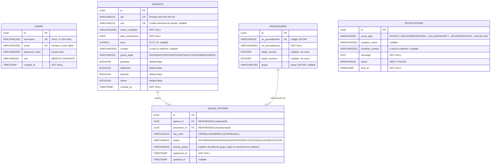

# ERD — Diagrama de Entidade-Relacionamento
> Hackathon FIAP PosTech — Arquitetura e Desenvolvimento Java — Fase 5

---

## Diagrama



---

## Descrição das Entidades

### USERS *(auth-service)*

Armazena as credenciais e o perfil de acesso de cada usuário do sistema.

| Coluna          | Tipo         | Restrições              | Descrição                                      |
|-----------------|--------------|-------------------------|------------------------------------------------|
| `id`            | UUID         | PK, NOT NULL            | Identificador único gerado automaticamente     |
| `username`      | VARCHAR(100) | UK, NOT NULL            | Nome de usuário para login                     |
| `email`         | VARCHAR(255) | UK, NOT NULL            | E-mail do usuário                              |
| `password_hash` | VARCHAR(255) | NOT NULL                | Senha cifrada com bcrypt (fator 10)            |
| `role`          | VARCHAR(20)  | NOT NULL                | Perfil de acesso: `MEDICO` ou `PACIENTE`       |
| `created_at`    | TIMESTAMP    | NOT NULL, DEFAULT NOW() | Data de criação do cadastro                    |

---

### PATIENTS *(queue-service)*

Representa o paciente que será inserido na fila de procedimentos do SUS.

| Coluna            | Tipo         | Restrições          | Descrição                                                             |
|-------------------|--------------|---------------------|-----------------------------------------------------------------------|
| `id`              | UUID         | PK, NOT NULL        | Identificador único                                                   |
| `cpf`             | VARCHAR(14)  | UK, NOT NULL        | CPF no formato `###.###.###-##`, validado na aplicação               |
| `cns`             | VARCHAR(15)  | UK, nullable        | Cartão Nacional de Saúde                                              |
| `nome_completo`   | VARCHAR(255) | NOT NULL            | Nome completo do paciente                                             |
| `data_nascimento` | DATE         | NOT NULL            | Usada para calcular automaticamente o grupo `IDOSO` (≥ 60 anos)      |
| `sexo`            | CHAR(1)      | nullable            | `M`, `F` ou `O` (outro)                                              |
| `contato`         | VARCHAR(255) | nullable            | E-mail ou telefone para recebimento de notificações                   |
| `grupo_legal`     | VARCHAR(20)  | NOT NULL            | Calculado automaticamente — ver regra abaixo                         |
| `gestante`        | BOOLEAN      | NOT NULL, DEFAULT F | Determina grupo `GESTANTE` se `true` e paciente não é idoso          |
| `deficiente`      | BOOLEAN      | NOT NULL, DEFAULT F | Determina grupo `DEFICIENTE`                                          |
| `lactante`        | BOOLEAN      | NOT NULL, DEFAULT F | Determina grupo `LACTANTE`                                            |
| `obeso`           | BOOLEAN      | NOT NULL, DEFAULT F | Determina grupo `OBESO`                                               |
| `created_at`      | TIMESTAMP    | NOT NULL            | Data de cadastro no sistema                                           |

**Regra de cálculo do `grupo_legal`:**
```
SE idade >= 60            → IDOSO      (prioridade 1)
SENÃO SE gestante = true  → GESTANTE   (prioridade 2)
SENÃO SE deficiente = true→ DEFICIENTE (prioridade 3)
SENÃO SE lactante = true  → LACTANTE   (prioridade 4)
SENÃO SE obeso = true     → OBESO      (prioridade 5)
SENÃO                     → GERAL      (prioridade 6)
```

---

### PROCEDURES *(queue-service)*

Catálogo dos procedimentos disponíveis para agendamento na fila, baseado na tabela SIGTAP do Ministério da Saúde.

| Coluna            | Tipo         | Restrições   | Descrição                                                |
|-------------------|--------------|--------------|----------------------------------------------------------|
| `id`              | UUID         | PK, NOT NULL | Identificador único interno                              |
| `co_procedimento` | VARCHAR(20)  | UK, NOT NULL | Código oficial SIGTAP (ex: `0301010072`)                 |
| `no_procedimento` | VARCHAR(255) | NOT NULL     | Nome oficial do procedimento no SIGTAP                   |
| `idade_minima`    | INTEGER      | nullable     | Idade mínima em anos para elegibilidade (0 = sem restrição) |
| `idade_maxima`    | INTEGER      | nullable     | Idade máxima em anos para elegibilidade (null = sem limite) |
| `grupo`           | VARCHAR(100) | nullable     | Grupo funcional SIGTAP (ex: "CONSULTAS / ATENDIMENTOS")  |

> Populado via migration `V4__seed_procedures.sql` com ao menos 20 procedimentos representativos do SUS.

---

### QUEUE_ENTRIES *(queue-service)*

Núcleo do sistema — representa a entrada de um paciente na fila de um procedimento. É o registro sobre o qual o algoritmo de prioridade opera.

| Coluna           | Tipo        | Restrições                     | Descrição                                                     |
|------------------|-------------|--------------------------------|---------------------------------------------------------------|
| `id`             | UUID        | PK, NOT NULL                   | Identificador único                                           |
| `patient_id`     | UUID        | FK → patients(id), NOT NULL    | Paciente na fila                                              |
| `procedure_id`   | UUID        | FK → procedures(id), NOT NULL  | Procedimento solicitado                                       |
| `risk_color`     | VARCHAR(10) | NOT NULL, DEFAULT `AZUL`       | Cor de risco clínico: `VERMELHO`, `AMARELO`, `VERDE`, `AZUL`  |
| `status`         | VARCHAR(20) | NOT NULL, DEFAULT `AGUARDANDO` | Estado atual da entrada — ver ciclo de vida abaixo           |
| `priority_group` | VARCHAR(20) | NOT NULL                       | Espelho do `grupo_legal` do paciente no momento do cadastro   |
| `registered_at`  | TIMESTAMP   | NOT NULL                       | Timestamp de entrada na fila — desempate final do algoritmo   |
| `updated_at`     | TIMESTAMP   | nullable                       | Última atualização de status ou cor                           |

> `priority_group` é copiado de `patients.grupo_legal` no momento da inserção e **não é atualizado automaticamente** se o grupo do paciente mudar.

**Algoritmo de ordenação da fila:**
```sql
ORDER BY
  risk_color     ASC,   -- VERMELHO(1) > AMARELO(2) > VERDE(3) > AZUL(4)
  priority_group ASC,   -- IDOSO(1) > GESTANTE(2) > ... > GERAL(6)
  registered_at  ASC    -- quem entrou primeiro
```

---

### NOTIFICATIONS *(notification-service)*

Histórico de todas as notificações enviadas (ou com falha) como resultado do consumo de eventos RabbitMQ.

| Coluna              | Tipo         | Restrições          | Descrição                                                   |
|---------------------|--------------|---------------------|-------------------------------------------------------------|
| `id`                | UUID         | PK, NOT NULL        | Identificador único                                         |
| `event_type`        | VARCHAR(30)  | NOT NULL            | Tipo do evento que originou a notificação                   |
| `recipient_name`    | VARCHAR(255) | nullable            | Nome do paciente notificado                                 |
| `recipient_contact` | VARCHAR(255) | nullable            | E-mail ou telefone para onde a notificação foi enviada      |
| `message`           | TEXT         | NOT NULL            | Conteúdo completo da mensagem enviada                       |
| `status`            | VARCHAR(20)  | NOT NULL            | `SENT` — enviado com sucesso \| `FAILED` — erro no envio   |
| `sent_at`           | TIMESTAMP    | NOT NULL            | Momento em que o processamento ocorreu                      |

---

## Ciclo de Vida de QUEUE_ENTRIES

```
                    ┌─────────────┐
         cadastro   │  AGUARDANDO │ ◀──────────────────────────────┐
        ──────────▶ └──────┬──────┘                                 │
                           │                                         │
             call-next ────┤                                         │ devolver
                           │                                         │ à fila
                    ┌──────▼──────┐                                  │
                    │  AGENDADO   │                                   │
                    └──────┬──────┘                                  │
                           │                                         │
              ┌────────────┼────────────┐                           │
              │            │            │                           │
       ┌──────▼───┐  ┌─────▼───┐  ┌───▼────────┐                  │
       │ ATENDIDO │  │  FALTOU │  │ CANCELADO  │                   │
       └──────────┘  └────┬────┘  └────────────┘                   │
                          │                                          │
                          └──────────────────────────────────────────┘
```

| Transição                | De           | Para        | Gatilho                              |
|--------------------------|--------------|-------------|--------------------------------------|
| Cadastro na fila         | —            | AGUARDANDO  | Use case `RegisterPatientInQueue`    |
| Chamada do próximo       | AGUARDANDO   | AGENDADO    | Use case `CallNextPatient`           |
| Atendimento confirmado   | AGENDADO     | ATENDIDO    | Uso futuro / manual                  |
| Não comparecimento       | AGENDADO     | FALTOU      | Uso futuro / manual                  |
| Cancelamento             | AGUARDANDO, AGENDADO | CANCELADO | Use case `CancelQueueEntry`    |
| Devolução à fila         | FALTOU       | DEVOLVIDO → AGUARDANDO | Fluxo de reentrada       |
| Reclassificação de cor   | AGUARDANDO, DEVOLVIDO | mesmo status | Use case `ReclassifyPriority` |

---

## Relacionamentos

| Relacionamento              | Cardinalidade | Descrição                                                         |
|-----------------------------|---------------|-------------------------------------------------------------------|
| PATIENTS → QUEUE_ENTRIES    | 1 : N         | Um paciente pode ter múltiplas entradas em filas diferentes       |
| PROCEDURES → QUEUE_ENTRIES  | 1 : N         | Um procedimento pode ter múltiplos pacientes na fila              |
| USERS ↔ PATIENTS            | sem FK        | Serviços independentes — `patients.cpf` pode ser usado para associar manualmente |
| QUEUE_ENTRIES ↔ NOTIFICATIONS | sem FK      | Notificações são criadas pelo notification-service a partir de eventos, não há FK direta |

> Os serviços `auth-service` e `notification-service` **não possuem foreign keys** para tabelas de outros serviços. A comunicação entre domínios ocorre via eventos (RabbitMQ) ou via API REST, nunca por joins no banco.

---

## Scripts de Criação (referência)

```sql
-- auth-service
CREATE TABLE users (
    id            UUID PRIMARY KEY DEFAULT gen_random_uuid(),
    username      VARCHAR(100) NOT NULL UNIQUE,
    email         VARCHAR(255) NOT NULL UNIQUE,
    password_hash VARCHAR(255) NOT NULL,
    role          VARCHAR(20)  NOT NULL CHECK (role IN ('MEDICO','PACIENTE')),
    created_at    TIMESTAMP    NOT NULL DEFAULT NOW()
);

-- queue-service
CREATE TABLE procedures (
    id               UUID PRIMARY KEY DEFAULT gen_random_uuid(),
    co_procedimento  VARCHAR(20)  NOT NULL UNIQUE,
    no_procedimento  VARCHAR(255) NOT NULL,
    idade_minima     INTEGER,
    idade_maxima     INTEGER,
    grupo            VARCHAR(100)
);

CREATE TABLE patients (
    id               UUID PRIMARY KEY DEFAULT gen_random_uuid(),
    cpf              VARCHAR(14)  NOT NULL UNIQUE,
    cns              VARCHAR(15)  UNIQUE,
    nome_completo    VARCHAR(255) NOT NULL,
    data_nascimento  DATE         NOT NULL,
    sexo             CHAR(1)      CHECK (sexo IN ('M','F','O')),
    contato          VARCHAR(255),
    grupo_legal      VARCHAR(20)  NOT NULL,
    gestante         BOOLEAN      NOT NULL DEFAULT FALSE,
    deficiente       BOOLEAN      NOT NULL DEFAULT FALSE,
    lactante         BOOLEAN      NOT NULL DEFAULT FALSE,
    obeso            BOOLEAN      NOT NULL DEFAULT FALSE,
    created_at       TIMESTAMP    NOT NULL DEFAULT NOW()
);

CREATE TABLE queue_entries (
    id              UUID PRIMARY KEY DEFAULT gen_random_uuid(),
    patient_id      UUID        NOT NULL REFERENCES patients(id),
    procedure_id    UUID        NOT NULL REFERENCES procedures(id),
    risk_color      VARCHAR(10) NOT NULL DEFAULT 'AZUL'
                        CHECK (risk_color IN ('VERMELHO','AMARELO','VERDE','AZUL')),
    status          VARCHAR(20) NOT NULL DEFAULT 'AGUARDANDO'
                        CHECK (status IN ('AGUARDANDO','AGENDADO','ATENDIDO','FALTOU','CANCELADO','DEVOLVIDO')),
    priority_group  VARCHAR(20) NOT NULL,
    registered_at   TIMESTAMP   NOT NULL DEFAULT NOW(),
    updated_at      TIMESTAMP
);

CREATE INDEX idx_queue_entries_priority
    ON queue_entries (risk_color, priority_group, registered_at)
    WHERE status = 'AGUARDANDO';

-- notification-service
CREATE TABLE notifications (
    id                UUID PRIMARY KEY DEFAULT gen_random_uuid(),
    event_type        VARCHAR(30)  NOT NULL,
    recipient_name    VARCHAR(255),
    recipient_contact VARCHAR(255),
    message           TEXT         NOT NULL,
    status            VARCHAR(20)  NOT NULL CHECK (status IN ('SENT','FAILED')),
    sent_at           TIMESTAMP    NOT NULL DEFAULT NOW()
);
```

> O índice `idx_queue_entries_priority` otimiza a query mais crítica do sistema: buscar o próximo paciente a ser chamado e calcular posições na fila.

---

*Documento gerado em: maio/2026*
