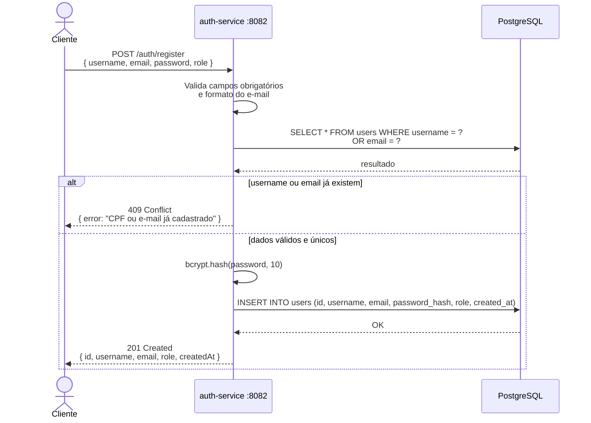
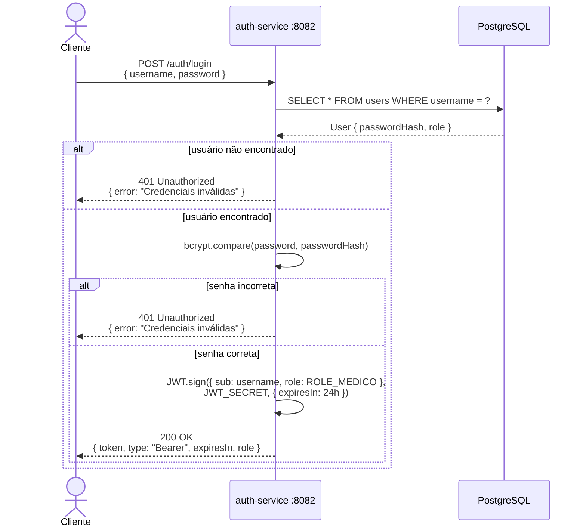
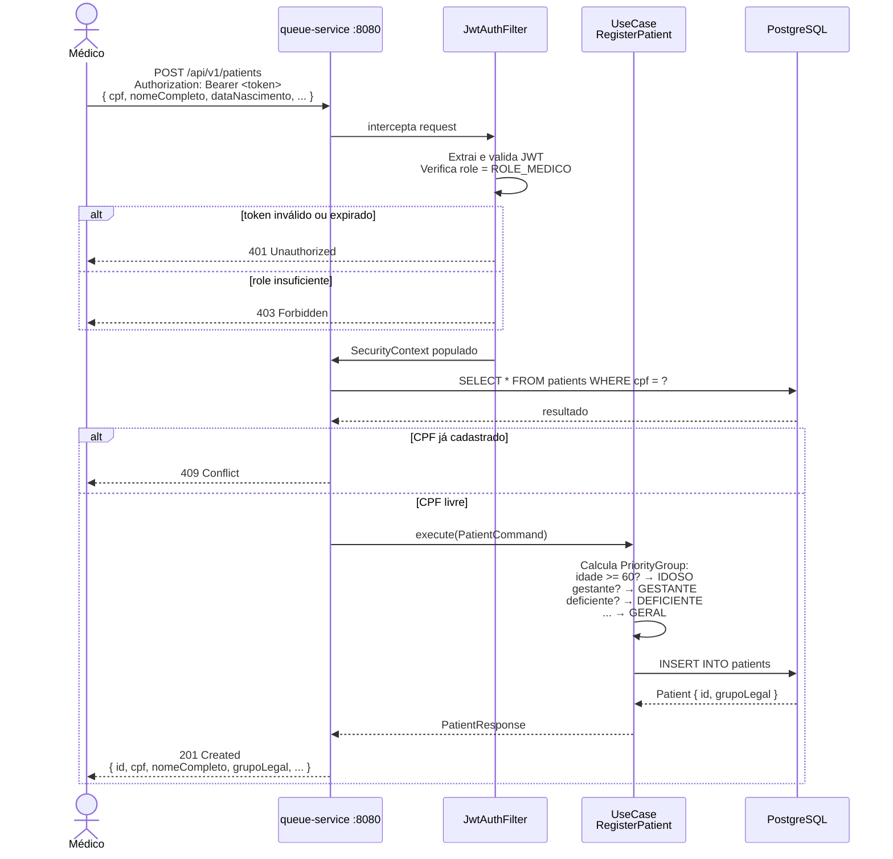
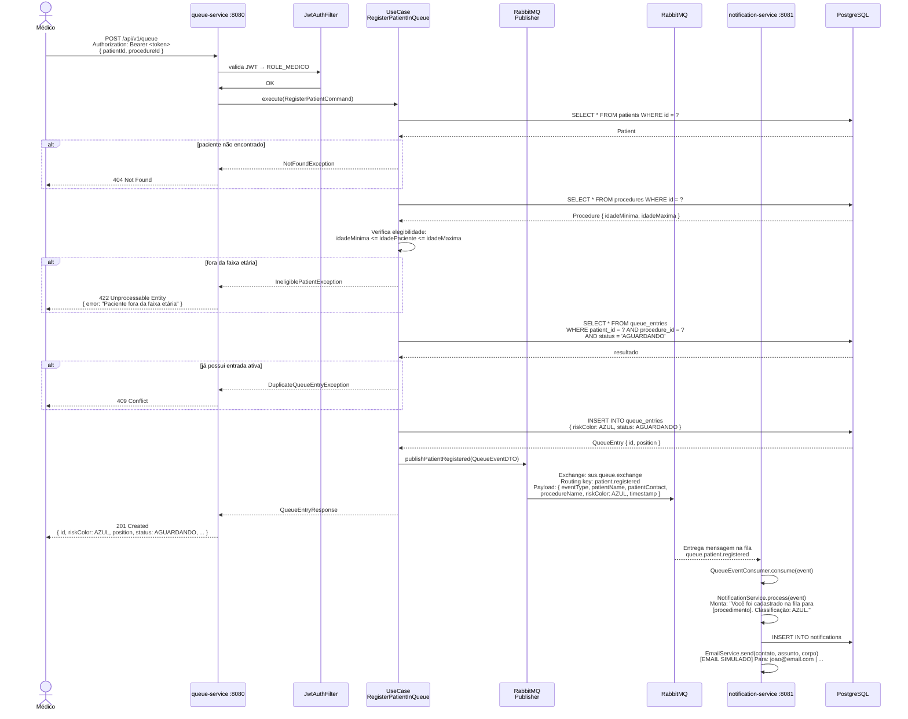
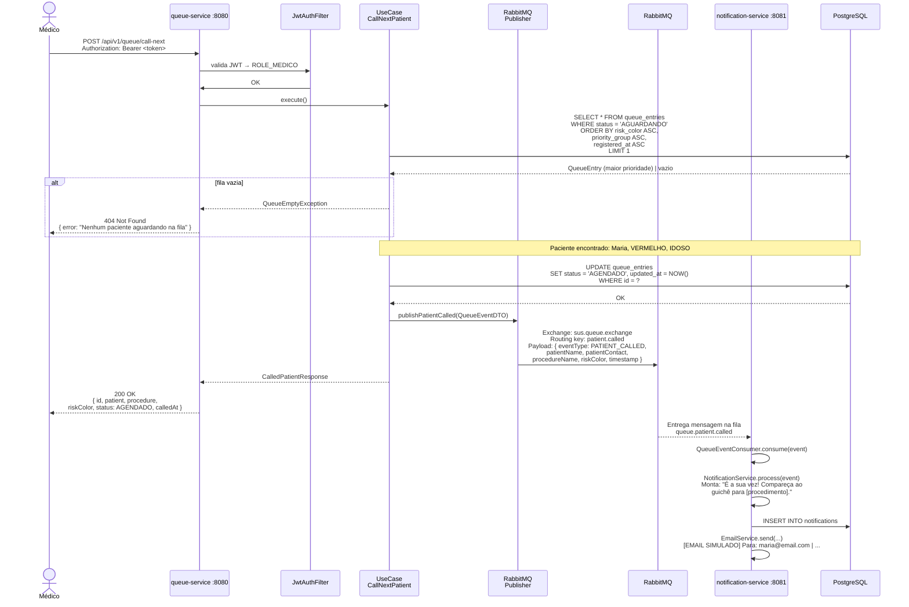
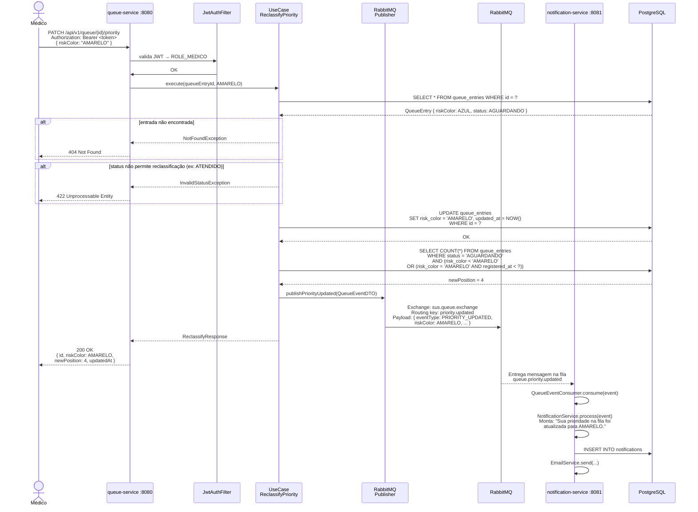
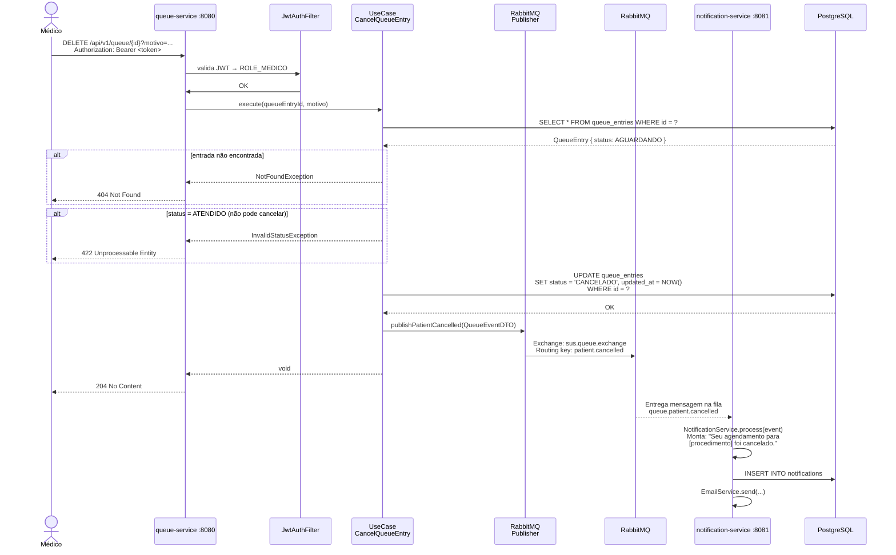
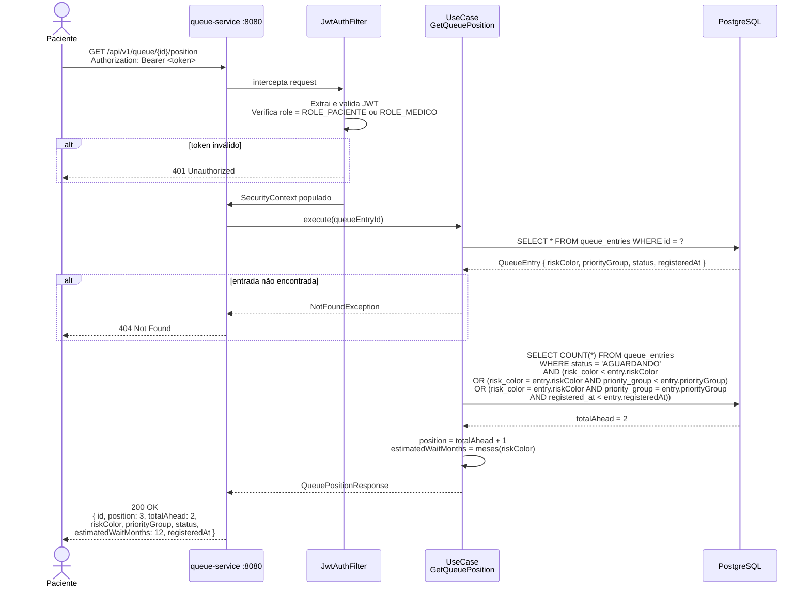
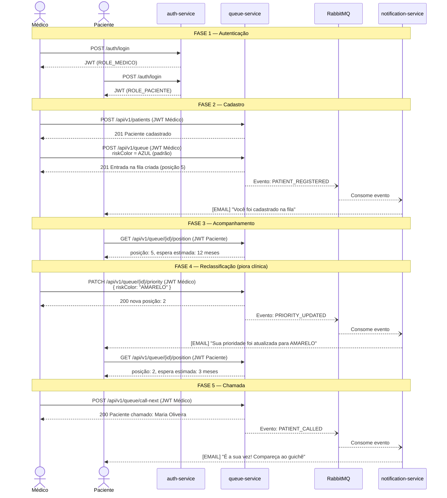

# Diagramas de Sequência — Sistema de Fila SUS
> Hackathon FIAP PosTech — Arquitetura e Desenvolvimento Java — Fase 5

---

## Índice

1. [Registro de Usuário](#1-registro-de-usuário)
2. [Login e Obtenção do JWT](#2-login-e-obtenção-do-jwt)
3. [Cadastro de Paciente](#3-cadastro-de-paciente)
4. [Inclusão na Fila](#4-inclusão-na-fila)
5. [Chamada do Próximo Paciente](#5-chamada-do-próximo-paciente)
6. [Reclassificação de Prioridade](#6-reclassificação-de-prioridade)
7. [Cancelamento de Entrada na Fila](#7-cancelamento-de-entrada-na-fila)
8. [Consulta de Posição pelo Paciente](#8-consulta-de-posição-pelo-paciente)
9. [Fluxo Completo — Visão Geral](#9-fluxo-completo--visão-geral)

---

## 1. Registro de Usuário

Criação de um novo usuário com role `MEDICO` ou `PACIENTE`.

---

## 2. Login e Obtenção do JWT

Autenticação e emissão do token que será usado em todas as chamadas ao queue-service.

> O token gerado contém a **role** do usuário no payload e é **validado localmente** pelo queue-service a cada request, sem round-trip ao auth-service.

---

## 3. Cadastro de Paciente

Registro de um paciente no sistema pelo médico. O grupo legal é calculado automaticamente.

---

## 4. Inclusão na Fila

Cadastro de um paciente em um procedimento. A entrada inicia com cor **AZUL** e publica evento para notificação.

---

## 5. Chamada do Próximo Paciente

O médico chama o próximo da fila. O sistema aplica o algoritmo de prioridade e dispara a notificação.

---

## 6. Reclassificação de Prioridade

O médico altera a cor de risco de um paciente já na fila (ex: estado clínico piorou).

---

## 7. Cancelamento de Entrada na Fila

Remoção de um paciente da fila pelo médico, com notificação automática.

---

## 8. Consulta de Posição pelo Paciente

O paciente consulta sua posição atual na fila sem precisar ter role de médico.

---

## 9. Fluxo Completo — Visão Geral

Visão macro de uma jornada completa: do login até o atendimento do paciente.

---

## Legenda dos Participantes

| Participante            | Descrição                                                            |
|-------------------------|----------------------------------------------------------------------|
| **Médico**              | Profissional de saúde com `ROLE_MEDICO` — gerencia a fila           |
| **Paciente**            | Usuário com `ROLE_PACIENTE` — consulta sua posição                  |
| **auth-service**        | Serviço de autenticação, emite e valida credenciais                 |
| **queue-service**       | Núcleo do sistema — aplica regras de negócio e publica eventos      |
| **JwtAuthFilter**       | Filtro Spring Security que intercepta e valida o Bearer token       |
| **UseCase**             | Camada Application do queue-service (Clean Architecture)            |
| **RabbitMQ Publisher**  | Porta de saída na camada Infrastructure — publica eventos no broker |
| **RabbitMQ**            | Message broker — desacopla queue-service do notification-service    |
| **notification-service**| Consome eventos e envia notificações ao paciente                    |
| **PostgreSQL**          | Banco de dados compartilhado pelos serviços                         |

---

*Documento gerado em: maio/2026*
