# Diagramas de Sequência — Sistema de Fila SUS
> Hackathon FIAP PosTech — Arquitetura e Desenvolvimento Java — Fase 5

---

## Índice

1. [Registro de Usuário](#1-registro-de-usuário)
2. [Login e Obtenção do JWT](#2-login-e-obtenção-do-jwt)
3. [Cadastro de Paciente](#3-cadastro-de-paciente)
4. [Inclusão na Fila](#4-inclusão-na-fila)
5. [Chamada do Próximo Paciente](#5-chamada-do-próximo-paciente)
6. [Reclassificação de Prioridade](#6-reclassificação-de-prioridade)
7. [Cancelamento de Entrada na Fila](#7-cancelamento-de-entrada-na-fila)
8. [Consulta de Posição pelo Paciente](#8-consulta-de-posição-pelo-paciente)
9. [Fluxo Completo — Visão Geral](#9-fluxo-completo--visão-geral)

---

## 1. Registro de Usuário

Criação de um novo usuário. O campo `role` aceita um dos cinco valores: `MEDICO`, `PACIENTE`, `SOLICITANTE`, `REGULADOR` ou `EXECUTANTE`.

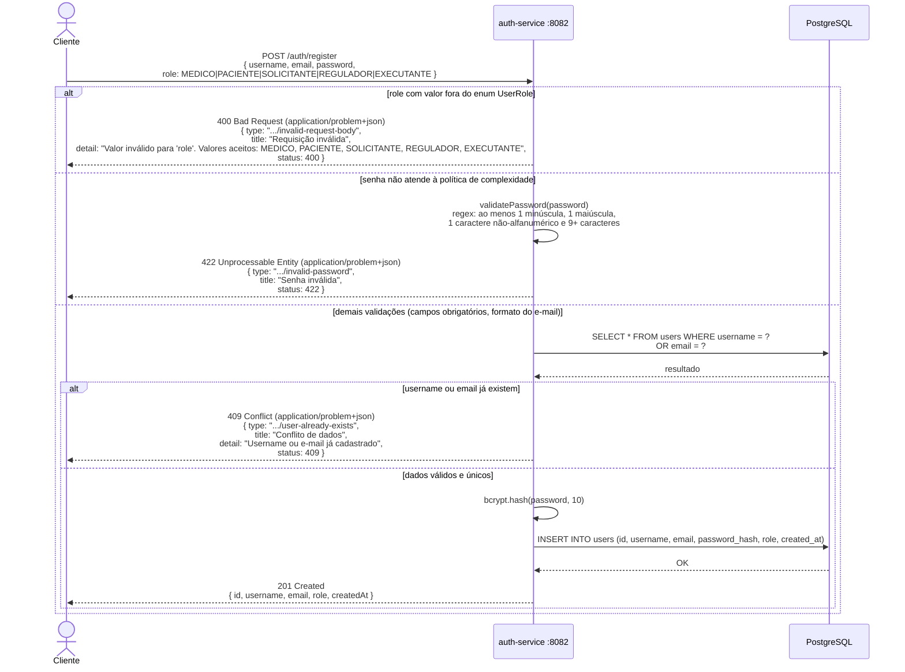

---

## 2. Login e Obtenção do JWT

Autenticação e emissão do token que será usado em todas as chamadas ao queue-service.

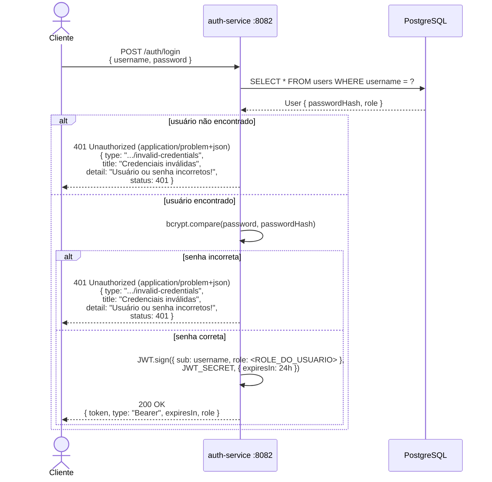

---

## 3. Cadastro de Paciente

Registro de um paciente no sistema pelo médico. O grupo legal é calculado automaticamente.

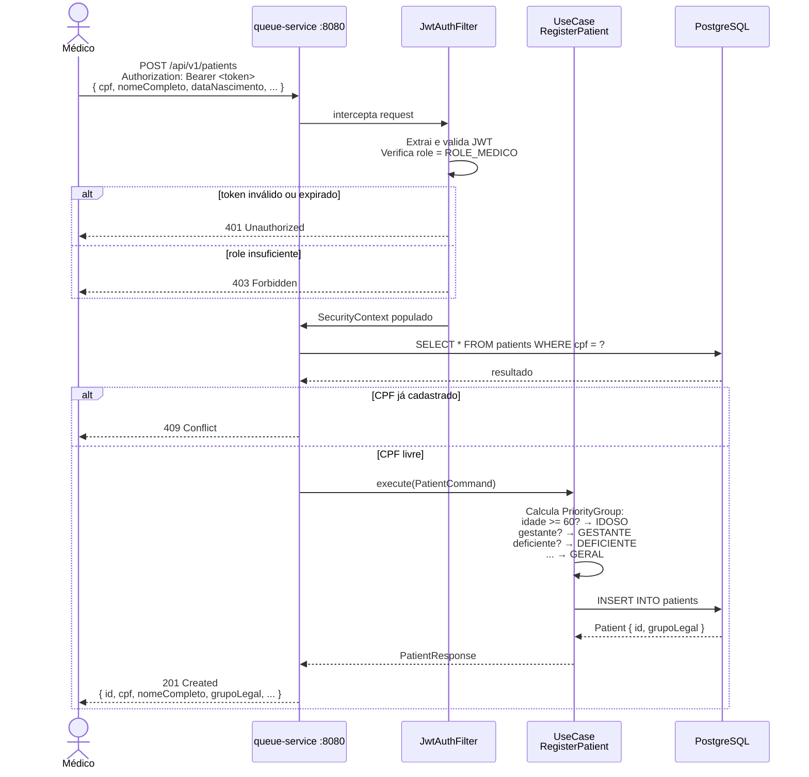

---

## 4. Inclusão na Fila

Cadastro de um paciente em um procedimento. A entrada inicia com cor **AZUL** e publica evento para notificação.

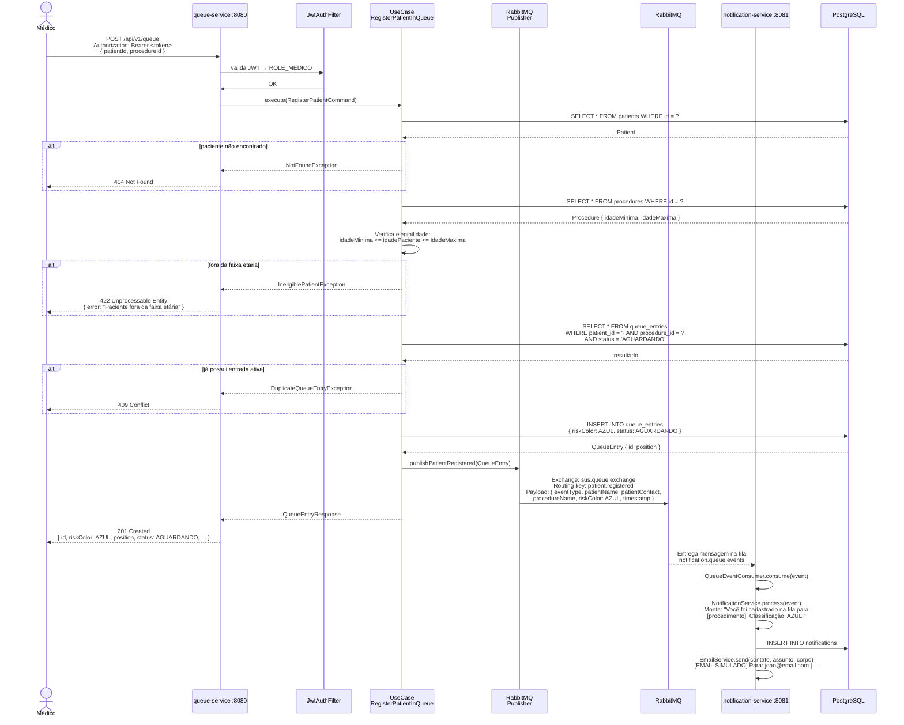

---

## 5. Chamada do Próximo Paciente

O médico chama o próximo da fila. O sistema aplica o algoritmo de prioridade e dispara a notificação.

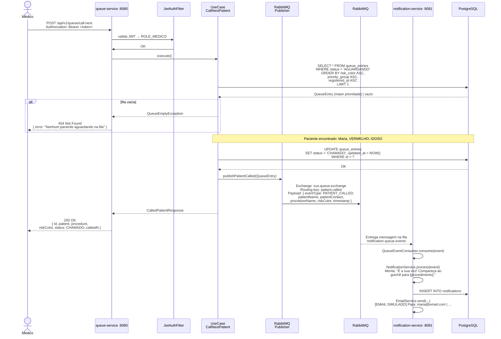
---

## 6. Reclassificação de Prioridade

O médico altera a cor de risco de um paciente já na fila (ex: estado clínico piorou).

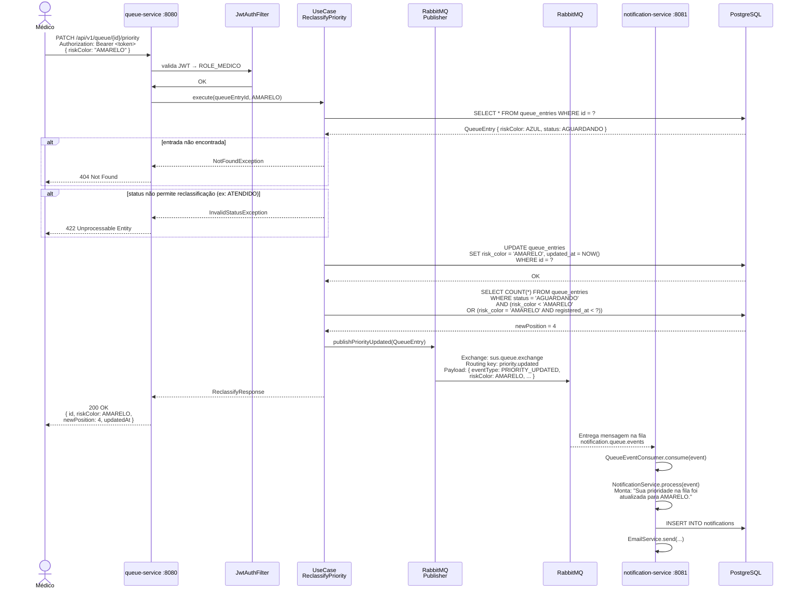

---

## 7. Cancelamento de Entrada na Fila

Remoção de um paciente da fila pelo médico, com notificação automática.

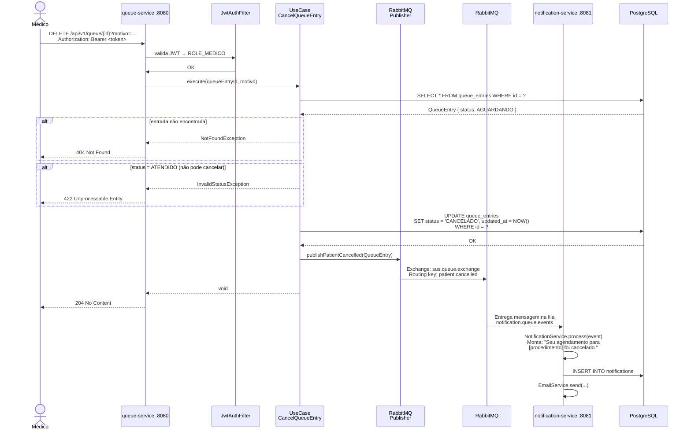

---

## 8. Consulta de Posição pelo Paciente

O paciente consulta sua posição atual na fila sem precisar ter role de médico.

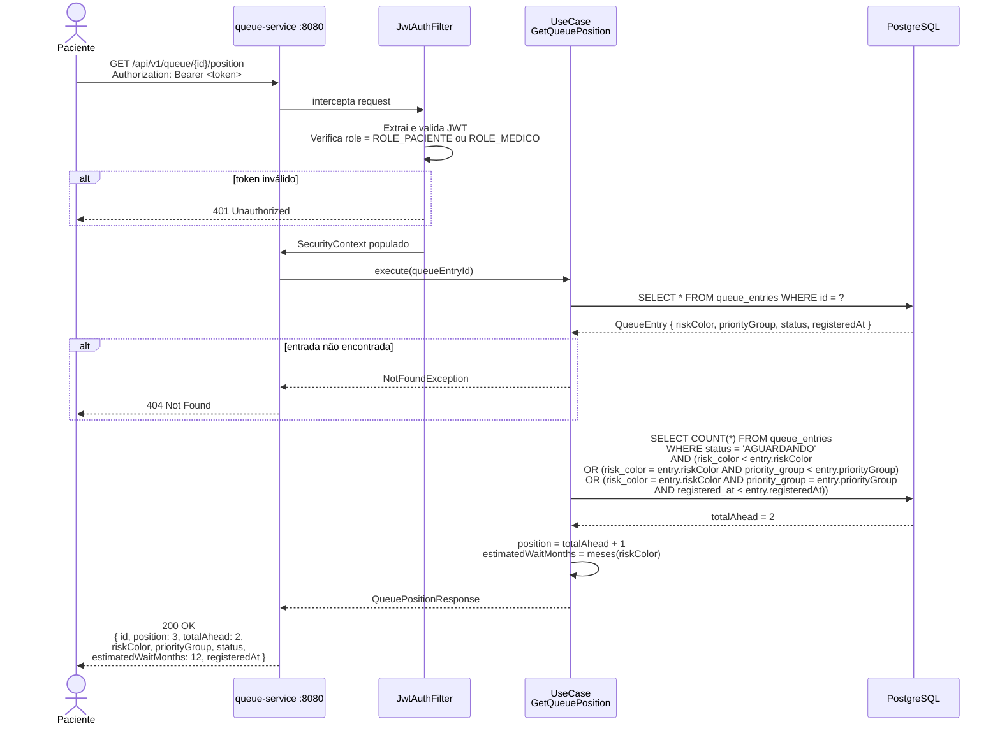

---

## 9. Fluxo Completo — Visão Geral

Visão macro de uma jornada completa: do login até o atendimento do paciente.

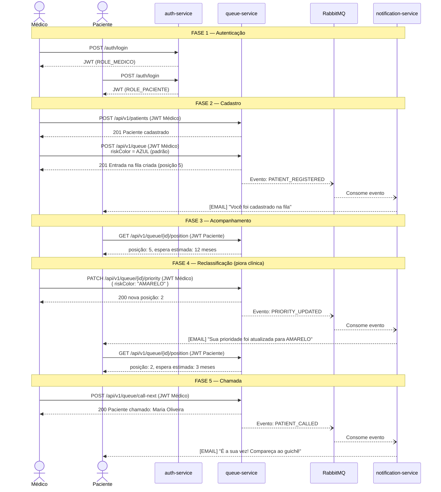

---

---

## 10. Solicitação Aprovada → Fila → Agendamento (Caminho Feliz)

Fluxo completo de ponta a ponta: UBS cria solicitação, regulador aprova, paciente entra na fila, é chamado e recebe slot confirmado.

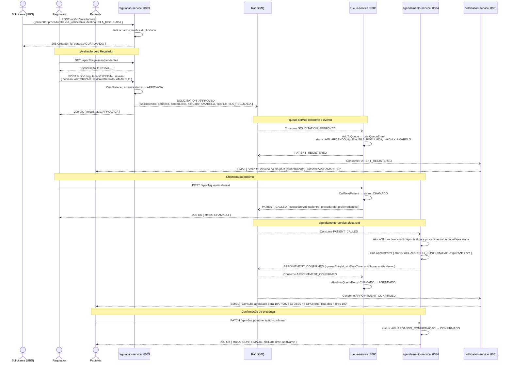

---

## 11. Solicitação Negada pelo Regulador

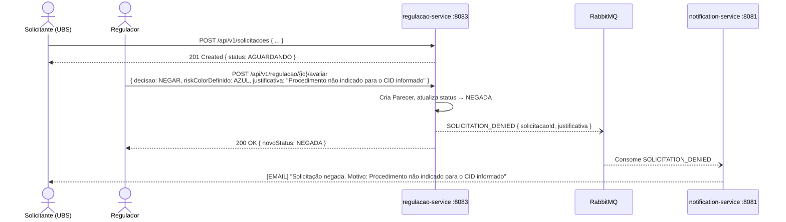

---

## 12. Agendamento Expirado — Reinserção na Fila

Quando o paciente não confirma presença em 72 horas, o job de expiração cancela o agendamento e o queue-service reinserirá o paciente na fila.

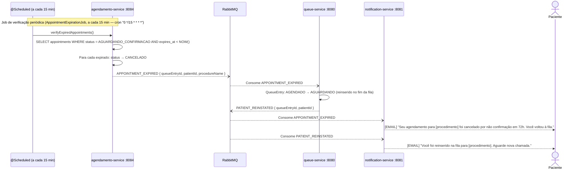

---

## 13. Paciente Faltou — Reinserção na Fila

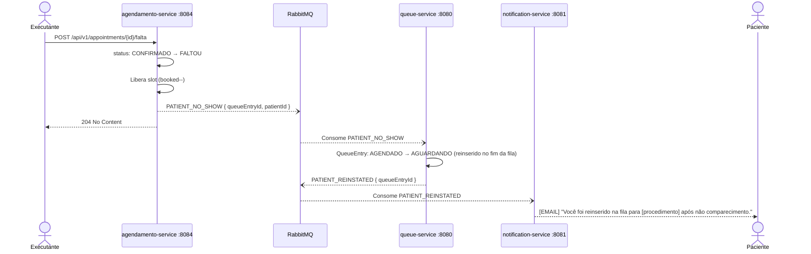

---

## Legenda dos Participantes

| Participante              | Descrição                                                                  |
|---------------------------|----------------------------------------------------------------------------|
| **Médico**                | Profissional com `ROLE_MEDICO` — gerencia a fila                          |
| **Paciente**              | Usuário com `ROLE_PACIENTE` — consulta posição e confirma presença        |
| **Solicitante (UBS)**     | Operador com `ROLE_SOLICITANTE` — cria solicitações na UBS                |
| **Regulador**             | Médico regulador com `ROLE_REGULADOR` — avalia e emite pareceres          |
| **Executante**            | Responsável da unidade com `ROLE_EXECUTANTE` — registra faltas e grades   |
| **auth-service**          | Serviço de autenticação, emite JWT                                        |
| **regulacao-service**     | Upstream — gerencia solicitações e pareceres (Hexagonal Architecture)     |
| **queue-service**         | Núcleo do sistema — fila priorizada (Clean Architecture)                  |
| **agendamento-service**   | Downstream — gerencia slots e agendamentos (CQRS + GraphQL)               |
| **notification-service**  | Consome todos os eventos e notifica pacientes e UBS (Event-driven)        |
| **RabbitMQ**              | Message broker — desacopla todos os serviços                              |
| **PostgreSQL**            | Banco de dados — cada serviço tem seu próprio schema                      |
| **@Scheduled**            | Job Spring periódico no agendamento-service para expiração de 72h         |

---

*Documento gerado em: maio/2026*
